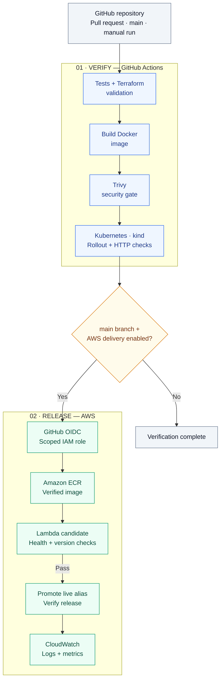

# Cloud DevOps Portfolio

### Container delivery, security checks, and recovery on AWS

[](https://github.com/Khalil1000/cloud-devops-project/actions/workflows/pipeline.yml)

A Python application delivered through GitHub Actions, with infrastructure managed by Terraform. Each release is built once as a Docker image, scanned for vulnerabilities, and verified on an ephemeral Kubernetes cluster before it can be promoted to AWS Lambda.

The project demonstrates the full delivery lifecycle: automated checks, scoped AWS authentication, release verification, monitoring, and recovery from deliberate failures.

**[Deployment evidence](docs/evidence/README.md) · [Build guide](docs/BUILD_GUIDE.md) · [Validation record](docs/VALIDATION.md) · [Incident report](docs/INCIDENT_REPORT.md)**

## Project highlights

- **Automated verification:** application tests, Terraform validation, a real Trivy image scan, and HTTP smoke checks on Kubernetes run in GitHub Actions.
- **Security gate:** fixable HIGH/CRITICAL vulnerabilities block delivery. A recorded failure was resolved by removing unnecessary Python installation tools from the runtime image, without weakening the scan policy.
- **Scoped AWS access:** GitHub OIDC supplies short-lived credentials. The deployment role's trust policy matches the exact repository identity and `main` branch.
- **Verified releases:** Lambda candidate versions pass health and release-identity checks before the `live` alias moves. Failed post-promotion verification triggers a rollback attempt.
- **Operational evidence:** documented exercises cover failing tests, Kubernetes pod replacement and rollout recovery, CloudWatch errors, and Lambda alias rollback.

## Architecture

The same built image moves through verification and release. Kubernetes runs locally and in CI; Lambda provides the AWS application runtime.



Terraform provisions IAM, ECR, Lambda, CloudWatch, and the encrypted, versioned S3 state backend with locking. A failed verification stage stops the job. A failed Lambda candidate check leaves the existing `live` alias unchanged; the deployment script also checks the alias after promotion and attempts to restore the previous version if verification fails.

## Evidence and results

| Demonstration | Recorded outcome |
|---|---|
| [Automated AWS delivery](docs/evidence/README.md#part-1-a-merged-change-deploys-to-aws-automatically) | A merged change reached Lambda, with the live alias and release identifier verified. |
| [Failing-test gate](docs/evidence/README.md#part-2-a-failing-test-blocks-delivery) | A deliberate test failure stopped later pipeline stages; restoring the test returned CI to green. |
| [Kubernetes recovery](docs/evidence/README.md#part-3-kubernetes-recovery-on-a-local-cluster) | A deleted pod was replaced, and a failed readiness rollout was rolled back and checked over HTTP. |
| [AWS monitoring and rollback](docs/evidence/README.md#part-4-an-aws-error-surfaces-correctly-and-a-lambda-rollback-works) | An intentional error appeared in CloudWatch; a previous Lambda version was restored, verified, and then returned to the current release. |
| [Vulnerability remediation](docs/evidence/README.md#part-5-the-vulnerability-gate-blocks-delivery-then-passes-after-remediation) | The scan blocked six findings; removing runtime installation tools produced a passing scan under the same policy. |

The [incident report](docs/INCIDENT_REPORT.md) records the Kubernetes rollout diagnosis, recovery steps, and observed timestamps.

## Current operating status

As of **4 October 2026**, [run #88](https://github.com/Khalil1000/cloud-devops-project/actions/runs/37166774042) completed the full pipeline on `main`, including GitHub OIDC authentication, ECR image publication, and Lambda release promotion. The deployed source commit was `cae347a70fa94f2000ab0165aae80d917aad0b6a`.

This release verified the corrected runtime image and deployment through the role restricted to this repository's exact `main` identity. Tests, Terraform validation, Trivy scanning, and Kubernetes verification also passed. The successful release step includes candidate health and version checks before promotion and verification of the `live` alias afterward. See [evidence Part 6](docs/evidence/README.md#part-6-aws-release-verified-after-the-trust-policy-restriction) and the [validation record](docs/VALIDATION.md).

AWS delivery is controlled by `AWS_DEPLOY_ENABLED`: `true` allows eligible main-branch releases, while `false` keeps CI verification active and skips AWS publication. Disabling delivery does not tear down existing resources.

## Design decisions

| Decision | Purpose and scope |
|---|---|
| **kind for Kubernetes** | Exercises Deployments, Services, probes, rolling updates, and recovery without a managed cluster. EKS operations and cloud load-balancer integration are outside this project's scope. |
| **Lambda for AWS execution** | Provides a container runtime with immutable versions and alias-based promotion, without an always-running application server. Invocations use the authenticated Lambda API. |
| **One image through the pipeline** | Kubernetes verifies the image that is subsequently pushed to ECR for the AWS release. |
| **OIDC instead of stored AWS keys** | Gives the workflow temporary credentials with repository and branch restrictions, plus permissions scoped to the delivery resources. |
| **Logs and metrics for observability** | CloudWatch error visibility is demonstrated. The optional email alarm is not configured. |

The AWS design uses no EKS cluster, EC2 instance, NAT gateway, load balancer, public function URL, or provisioned concurrency. ECR storage, S3 state, logs, and Lambda usage can still incur charges. Pausing delivery does not delete resources. The [build guide](docs/BUILD_GUIDE.md) includes a budget alert, release pruning, and teardown instructions.

## Run locally

From the repository root, using Python 3.13 and a Bash-compatible terminal such as WSL:

```bash
python3 -m venv .venv
source .venv/bin/activate
python -m pip install -r app/requirements.txt
python -m unittest discover -s tests -v
python app/app.py
```

Open [localhost:8080](http://127.0.0.1:8080). This starts the application without creating AWS resources. Follow the [build guide](docs/BUILD_GUIDE.md) for Docker, Kubernetes, Terraform, and AWS setup.

## Repository map

| Path | Contents |
|---|---|
| [`app/`](app/) | Flask application, health endpoints, release identity, and structured logs |
| [`tests/`](tests/) | Application, scan-policy, and Lambda response checks |
| [`Dockerfile`](Dockerfile) | Container image shared by Kubernetes and Lambda |
| [`.github/workflows/pipeline.yml`](.github/workflows/pipeline.yml) | Verification and conditional AWS release workflow |
| [`infra/`](infra/) | Terraform bootstrap and application infrastructure |
| [`k8s/`](k8s/) | Local cluster configuration and application manifests |
| [`scripts/`](scripts/) | Scanning, deployment, smoke checks, and cleanup tools |
| [`events/`](events/) | Lambda invocation payloads |
| [`docs/`](docs/) | Build guide, validation record, incident report, and evidence |
