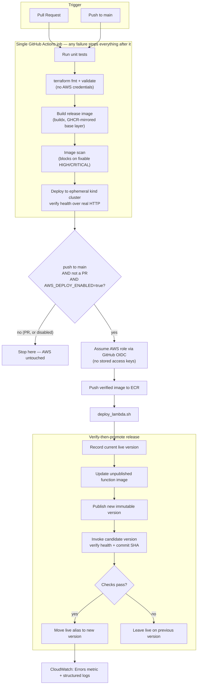

# Cloud DevOps Portfolio — a low-cost AWS project

A small Python application, packaged once as a Docker image, tested on local Kubernetes, and deployed to AWS Lambda through GitHub Actions.

Start with the step-by-step build guide. It explains what to run, why each step exists, what success looks like, and how to recover when something goes wrong.

## What you will demonstrate

- Terraform creates AWS infrastructure and keeps its main state in encrypted, versioned S3 storage with locking.
- Kubernetes Deployments, Services, probes and rolling updates run on your laptop using `kind`. The CI pipeline also creates an ephemeral `kind` cluster.
- A failed test or fixable HIGH/CRITICAL image vulnerability blocks delivery.
- GitHub Actions authenticates to AWS with a scoped role and short-lived OIDC credentials.
- AWS runs the same container image on Lambda. A new version is checked before the `live` alias moves to it.
- CloudWatch provides application logs and built-in Lambda metrics. One email alarm is an optional exercise.

The guide includes failure drills, an incident note template and full cleanup.

## Architecture

One image, one pipeline, two runtimes: `kind` locally for verification, Lambda in AWS for the real release.



## Cost scope

There are no EKS clusters, EC2 instances, NAT gateways, load balancers, provisioned concurrency settings, public function URLs or scheduled jobs. Kubernetes runs locally. AWS still supplies real application execution through Lambda, private images through ECR, S3 state storage, IAM and CloudWatch.

Local work needs no AWS resources. The AWS portion may be free within your account's allowances, but ECR, S3 and logs can incur small usage charges. The guide shows a $1 budget alert, a pricing example, short log retention, release pruning and teardown. A budget alert is not a spending cap.

## Files to understand first

| Path | Purpose |
|---|---|
| `app/app.py` | Web app, release identifier, health checks and JSON logs |
| `Dockerfile` | One image that runs locally, in Kubernetes and in Lambda |
| `k8s/` | Local cluster and application manifests |
| `infra/bootstrap/` | S3 state bucket, budget alert and ECR repository |
| `infra/environment/` | Lambda, IAM, GitHub OIDC and optional error alarm |
| `.github/workflows/pipeline.yml` | Tests, security scan, Kubernetes verification and AWS release |
| `scripts/` | Installation, smoke tests, deployment and cleanup helpers |
| `events/` | Authenticated Lambda test request payloads |
| `docs/` | Build guide, incident template and validation record |

## Quick local start

After installing Python and downloading this project:

```bash
python3 -m venv .venv
source .venv/bin/activate
python -m pip install -r app/requirements.txt
python -m unittest discover -s tests -v
python app/app.py
```

Open http://127.0.0.1:8080. Continue in the build guide for Docker, Kubernetes, AWS and the CI/CD workflow. This quick start does not create AWS resources.

## Evidence

Every claim above is backed by a real, screenshotted run rather than a description of what should happen:

- **[`docs/evidence/README.md`](docs/evidence/README.md)** — the full proof set, in order:
  - **Part 1:** a merged change deploying to AWS automatically, with the `live` alias moving and the correct commit SHA verified over HTTP
  - **Part 2:** a failing test blocking delivery — red check, blocked merge, later steps skipped, restored to green
  - **Part 3:** two Kubernetes recovery drills on a local `kind` cluster — automatic pod replacement, and a rejected rollout that keeps serving traffic on the old revision until rolled back
  - **Part 4:** a deliberate AWS error surfacing in Lambda's `Errors` metric and structured CloudWatch logs, plus an independent Lambda-alias rollback to a prior immutable version
- **[`docs/INCIDENT_TEMPLATE.md`](docs/INCIDENT_TEMPLATE.md)** — a filled incident note for the rollout-rejection drill: real timestamps, root cause traced to a failing readiness probe, the rollback command, and what I'd improve next.

## Honest project description

This is a learning and portfolio system with local Kubernetes and an AWS serverless deployment. It is not a production EKS platform or a highly available multi-region service. Explain these choices in interviews: they preserve the delivery and troubleshooting lessons while controlling cost.

**Why `kind` instead of EKS:** a local cluster gives the same Deployments, Services, probes, rolling updates and `kubectl`-level diagnosis that a managed cluster would, at zero infrastructure cost and with faster iteration. What it doesn't prove is multi-node scheduling, cloud load balancer integration, or cluster-autoscaler behavior — those are real gaps, not hidden ones, and they're exactly what would need to be added for a genuine production Kubernetes target.

**Why Lambda instead of EKS/ECS for the actual AWS release:** the project's real constraint is cost at rest. Lambda bills per invocation with no idle charge, so a portfolio project that gets looked at occasionally doesn't accrue a running bill between visits. The tradeoff is architectural, not just financial — Lambda's immutable versions and alias-based promotion is a different (and in some ways simpler) rollback model than a Kubernetes Deployment's revision history, which is part of why this project deliberately practices and documents both (see Evidence, above) rather than treating them as interchangeable.

## Resume / CV bullet

Only use this after you've actually completed the guide and evidence steps above — don't add deployment time, recovery time or cost figures unless you've personally measured them; this project's own incident note is a good example of recording what was actually timed versus what wasn't.

> Built a container delivery pipeline with GitHub Actions, Terraform and AWS Lambda; validated deployments on local Kubernetes, used OIDC for AWS access, and demonstrated monitoring and rollback with controlled failure exercises.
