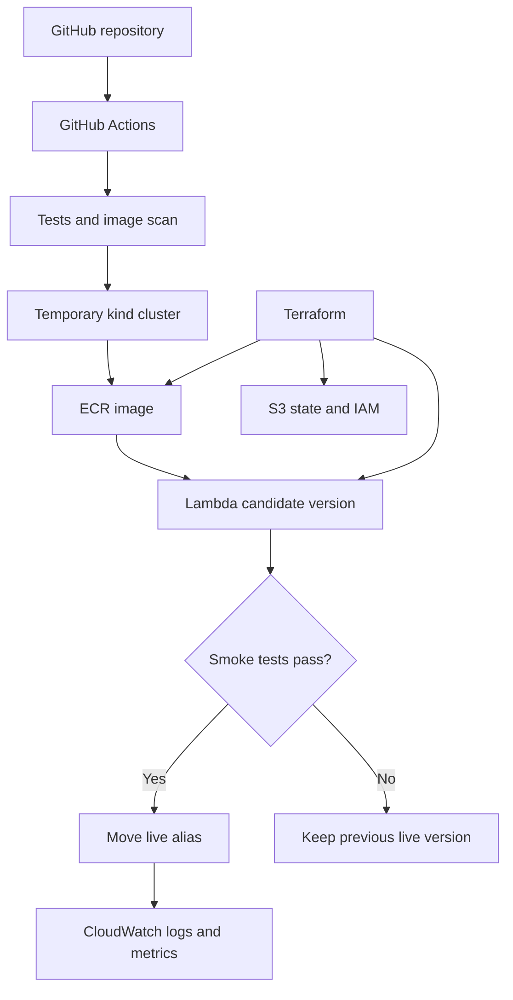

# Build a low-cost AWS and DevOps portfolio project

**Prepared 7 September 2026.** Follow the stages in order. Each stage explains
the purpose, the commands, the expected result and the useful interview lesson.
All commands use Bash and run from the extracted `cloud-devops-project` folder
unless a step explicitly says otherwise.

You can pause after any checkpoint. When asking for help, mention the stage
number, your operating system, the command and its error. Do not include access
keys, session tokens, Terraform state contents or passwords.

## 0. Understand the project and its cost boundaries

You will build one small Python web application with two deployment targets:

| Component | Where it runs | Why it is here |
| --- | --- | --- |
| Python app and Docker | Your computer | Learn the application and container before adding infrastructure |
| Kubernetes through kind | Your computer; also a temporary GitHub runner | Practice Deployments, Services, probes, rolling updates and recovery |
| AWS Lambda | AWS, on demand | Run a real AWS application without an always-on server |
| Amazon ECR | AWS | Store the actual private container images used by Lambda |
| Terraform state | Versioned, encrypted S3 bucket | Track your AWS infrastructure and lock concurrent state changes |
| GitHub Actions and OIDC | GitHub and AWS IAM | Test and release automatically using temporary AWS credentials |
| CloudWatch | AWS | Review JSON application logs and built-in Lambda metrics |
| Email error alarm | Optional AWS resource | Practice detection and incident response |

**Kubernetes does not run on AWS in this design.** Lambda runs the AWS workload.
You should describe this distinction accurately on your CV. Both targets use the
same application and Dockerfile; the pipeline tests its image on Kubernetes
before publishing that image to AWS.

The Dockerfile includes AWS Lambda Web Adapter, an AWS-maintained extension that
lets a normal HTTP application run in Lambda. Docker and kind start Gunicorn
normally. Lambda starts the additional extension, which forwards invocation
events to the app. [AWS Web Adapter documentation](https://github.com/aws/aws-lambda-web-adapter)

### Cost expectations

The local stages create **no AWS resources**. For the AWS stages, target a few
small releases and a few hundred manual requests. Keep the optional email alarm
off initially. This is designed for very low usage, not a guaranteed zero bill.

As a scale example, at the published US pricing of $0.10 per GB-month, keeping
0.2 GB of private ECR images for a month is about **$0.02 before any allowance**.
This is an illustration, not a measured size of your built images. Actual image
storage, requests, logs and data transfer depend on what you run. Check your
account's current allowances and credits in Billing. [ECR pricing](https://aws.amazon.com/ecr/pricing/)

AWS lists a Lambda allowance of 1 million requests and 400,000 GB-seconds per
month. Other usage in your account shares applicable allowances. We set this
function to 256 MB, a 10-second timeout and on-demand execution. We do not
configure provisioned concurrency. [Lambda pricing](https://aws.amazon.com/lambda/pricing/)

S3 object storage and requests, ECR storage, log ingestion and any optional alarm
can still be billable. Lambda's built-in metrics are available without the cost
of publishing custom metrics. We use the existing Lambda console charts instead
of creating a separately billed dashboard or custom metrics. [S3 pricing](https://aws.amazon.com/s3/pricing/),
[CloudWatch pricing](https://aws.amazon.com/cloudwatch/pricing/)

Use a public portfolio repository with standard GitHub-hosted Linux runners to
use GitHub's free public-repository compute. A private repository has a quota;
usage beyond that can be billed. This workflow creates no Actions caches or
uploaded artifacts. [GitHub Actions billing](https://docs.github.com/en/billing/concepts/product-billing/github-actions)

The supplied AWS configuration creates no EKS cluster, EC2 server, NAT gateway,
load balancer, database, public function URL, API Gateway or scheduled trigger.
Only callers with the necessary AWS permissions can invoke this function.
That is an IAM access boundary, not a private VPC network endpoint.

**A $1 budget alert is a notification, not a spending cap.** Billing data and
alerts can be delayed. Check Billing during the exercise and use Stage 15 to
remove the AWS resources when finished. [AWS Budgets guidance](https://docs.aws.amazon.com/cost-management/latest/userguide/budgets-managing-costs.html)

### How a release works



The cluster in this diagram lives on a temporary GitHub runner. Your laptop has
its own kind cluster for learning; GitHub does not remotely deploy into your
laptop. Merging a successful change automatically updates the AWS deployment.

## 1. Prepare your computer

**Why:** using one consistent terminal avoids mixing Windows paths, Linux
containers and different tool installations.

- **Windows:** install WSL2 with Ubuntu and Docker Desktop. Enable Docker
  Desktop's WSL integration for Ubuntu, then run all the guide's commands inside
  the Ubuntu terminal. Keep the project under your Linux home directory, such as
  `~/projects`, rather than inside `/mnt/c`. See the official
  [Docker Desktop WSL instructions](https://docs.docker.com/desktop/features/wsl/).
- **macOS:** use Terminal and Docker Desktop. Python 3.12 or 3.13 works for the
  local stages. Apple Silicon needs a native local Docker image; the separate
  AWS build command deliberately targets `linux/amd64`.
- **Linux:** use Bash, Python 3.12 or 3.13, Git, curl and Docker Engine. Follow
  [Docker's installation instructions](https://docs.docker.com/engine/install/)
  for your distribution. Ensure `docker info` works as your normal user.

On Ubuntu 24.04/WSL, install the basic tools if missing:

```bash
sudo apt update
sudo apt install -y python3 python3-venv python3-pip git curl ca-certificates
```

On macOS with Homebrew already installed, an example is:

```bash
brew install python@3.13 git curl awscli
brew install --cask docker
```

Start Docker Desktop after installation. If you already have these tools,
reuse them. You do not need to install a second Docker daemon inside WSL.

For AWS stages, install **AWS CLI v2**, version 2.32.0 or newer for the `aws login`
method used here. Follow the official installer for your OS. Avoid installing
the older v1 CLI through `pip install awscli`.
[AWS CLI installation](https://docs.aws.amazon.com/cli/latest/userguide/getting-started-install.html)

Download the project archive, extract it, and open a terminal in the resulting
folder. Confirm you can see `Dockerfile`, `app`, `infra`, `k8s` and `scripts`.

```bash
pwd
python3 --version
git --version
docker version
docker info
```

The project includes installers for pinned Terraform, kind and kubectl releases.
They download binaries from the publishers, compare SHA-256 checksums and install
them under this project's `tools/bin`. They do not require administrator rights.

```bash
bash scripts/install_terraform.sh
bash scripts/install_kind_tools.sh
export PATH="$PWD/tools/bin:$PATH"
terraform version
kind version
kubectl version --client
```

Reference versions are Terraform 1.14.6, kind 0.31.0 and kubectl 1.35.0. The
Docker runtime uses Python 3.13. These are deliberate version selections, not a
claim that they will remain the latest versions. Before a future upgrade, review
the release notes and rerun the checks. [kind documentation](https://kind.sigs.k8s.io/docs/user/quick-start/)

**Checkpoint:** every version command returns successfully and `docker info`
can contact the Docker engine. Allow roughly 4 GB of memory for Docker if your
computer has sufficient RAM; one local cluster is enough.

If an installer download fails or a checksum differs, stop that installer and
check the publisher's release page. Do not remove the checksum check to continue.

## 2. Run and understand the app locally

**Why:** if the app does not work on your laptop, adding containers and AWS
will make the failure harder to diagnose.

Create a Python virtual environment, which keeps this project's packages away
from your system Python:

```bash
python3 -m venv .venv
source .venv/bin/activate
python -m pip install -r app/requirements.txt
python -m unittest discover -s tests -v
python app/app.py
```

Keep this terminal running. Open <http://127.0.0.1:8080> in your browser. You
should see the project page with the version `local`.

Open another terminal in the project folder and run:

```bash
curl http://127.0.0.1:8080/healthz
curl http://127.0.0.1:8080/readyz
curl http://127.0.0.1:8080/version
python3 scripts/smoke_test.py http://127.0.0.1:8080 --expected-version local
```

| Endpoint | Meaning | Normal result |
| --- | --- | --- |
| `/` | Human-readable project page | HTTP 200 |
| `/healthz` | The process can respond | `{"status":"ok"}` |
| `/readyz` | The process should receive traffic | `{"status":"ready"}` |
| `/version` | Identify the deployed release | JSON containing `"version":"local"` |
| `POST /demo/error` | Controlled error exercise | HTTP 404 until the demo is enabled |

Read `app/app.py` after trying the endpoints. Each completed HTTP request writes
a JSON log with its path, status, duration, release version and severity. A 5xx
response gets `level: ERROR`. The duration is application handler time, not full
internet round-trip time.

The unit tests verify observable behavior: health versus readiness, release
identity, the disabled demo endpoint, structured error logging and the release
gate. The smoke test is different: it calls a running process over HTTP.

**Checkpoint:** the test suite ends in `OK` and the smoke test prints `PASS`.
Use Ctrl+C in the first terminal to stop the local server before the next stage.

## 3. Put the app in Docker

**Why:** Docker packages the app and its dependencies into an image that other
machines can run consistently.

Build a local image using your computer's native CPU architecture:

```bash
docker build --build-arg APP_VERSION=local -t portfolio:local .
docker run --rm --name portfolio-local -p 127.0.0.1:8080:8080 portfolio:local
```

From a second terminal, repeat the smoke test:

```bash
python3 scripts/smoke_test.py http://127.0.0.1:8080 --expected-version local
docker logs portfolio-local --tail 10
```

The Dockerfile installs pinned dependencies, copies only the application, runs
as user 10001 and starts Gunicorn. It exposes port 8080 inside the container.
The port mapping makes it available only on your computer's loopback address.

The image includes Lambda Web Adapter. It is inactive in this ordinary Docker
run because Lambda's extension system is not present. The app still runs as a
normal HTTP server.

Run the image scan from the second terminal:

```bash
bash scripts/scan_image.sh portfolio:local
```

This exports the image to a temporary tar file and scans it using Trivy. The
scanner does not receive your Docker socket or AWS credentials. A complete
report is written to `trivy.json`, which is excluded from Git.

The project blocks **HIGH or CRITICAL vulnerabilities with an available fix**.
Findings without fixes remain in the report for review. Passing this policy does
not mean the image contains no vulnerabilities. If the gate fails, update the
affected package or base image, rebuild and scan again. Do not simply disable
the gate to make the pipeline green. [Trivy image scanning](https://trivy.dev/docs/latest/guide/target/container_image/)

**Checkpoint:** the container's smoke test passes and you understand the scan
result. Ctrl+C stops this container; `--rm` removes the stopped container but
keeps its image.

## 4. Deploy locally with Kubernetes

**Why:** this is where you learn how a deployment maintains a desired number
of application instances, checks readiness and updates them safely.

Make sure your project-local tools are on PATH, then create a one-node cluster:

```bash
export PATH="$PWD/tools/bin:$PATH"
kind create cluster --name portfolio --config k8s/kind.yaml --wait 120s
kubectl --context kind-portfolio get nodes
bash scripts/deploy_local.sh portfolio:local local
```

The script loads your image into kind, creates the `portfolio` namespace,
renders the application YAML, applies it, waits for the rollout and runs the
HTTP smoke test. Its commands explicitly target `kind-portfolio` so they do not
accidentally use another Kubernetes context.

Inspect the result:

```bash
kubectl --context kind-portfolio -n portfolio get deployments,pods,services
kubectl --context kind-portfolio -n portfolio logs -l app=portfolio --tail=10
kubectl --context kind-portfolio -n portfolio port-forward service/portfolio 8080:80
```

Keep port-forward running and open <http://127.0.0.1:8080>. If port 8080 is
already in use, stop the previous Python/Docker server or use `8081:80` and
open port 8081 instead.

Read `k8s/app.yaml.tpl` and connect the settings to what you see:

- **Deployment:** asks Kubernetes to maintain two app pods.
- **Service:** provides one stable internal address for ready pods.
- **Readiness probe:** prevents traffic going to a pod that is not ready.
- **Liveness probe:** detects an unresponsive process so it can be restarted.
- **Rolling update:** allows one extra pod and keeps old ready pods during an update.
- **Resource requests/limits:** declare expected and maximum CPU/memory use.
- **Security context:** uses a non-root user, drops capabilities and makes the
  application filesystem read-only; `/tmp` is an explicitly writable volume.

Two pods on one node provide a useful rollout exercise, but they do not protect
against losing the whole node. This is a local lab, not a highly available cluster.

**Checkpoint:** the Deployment shows `2/2` ready and the page works through the
Service. Save a screenshot for your portfolio. Stop port-forward with Ctrl+C
when you no longer need it; the cluster itself will continue running locally.

## 5. Create the GitHub repository and run CI

**Why:** employers should be able to inspect the code, see the automated
checks, and understand how changes are delivered.

On GitHub, create an **empty repository** named `cloud-devops-project`. A public
repository is appropriate for a portfolio and standard public Actions runners
are free. Do not add a generated README or `.gitignore`; this project includes them.

From the project folder:

```bash
git init -b main
git add .
git status
git commit -m "Add low-cost AWS DevOps portfolio project"
git remote add origin https://github.com/YOUR-GITHUB-USERNAME/cloud-devops-project.git
git push -u origin main
```

Replace the username in the URL. If Git needs your author name/email, set them
for this repository with `git config user.name "Your Name"` and
`git config user.email "your GitHub commit email"`. Authenticate Git using your
normal GitHub method. If necessary, install GitHub CLI and use `gh auth login`;
your GitHub account password is not a Git HTTPS password.

Before committing, check that `.venv`, real `.tfvars`, state files, `tools/bin`
and credentials are absent from the staged files. The supplied `.gitignore`
excludes them. Commit `.terraform.lock.hcl` files when Terraform generates them;
those contain provider selections/checksums, not AWS credentials.

Open the repository's **Actions** tab. The `Portfolio pipeline` workflow should
run. It tests the app, validates Terraform, builds and scans the image, creates
a temporary kind cluster, deploys the image and smoke-tests it.

**AWS deployment is skipped at this stage.** The workflow requires a repository
variable named `AWS_DEPLOY_ENABLED` with the exact value `true` before it uses AWS.
There are no AWS credentials or resources required for the initial CI run.

If the formatting check fails, run this locally, review the changes and commit:

```bash
terraform fmt -recursive infra
git add infra
git commit -m "Format Terraform configuration"
git push
```

The full CI job is named **Test, scan and deploy**. Configure a branch rule or
ruleset for `main` requiring pull requests and that status check, if available
for your repository. Choose the actual check shown in GitHub's picker. For a
solo project, requiring someone else's approval can prevent you merging your
own work, so a required passing check is sufficient for this lab.

**Checkpoint:** Actions is green through the kind deployment, while the AWS
steps are skipped. This is a useful working project even before the AWS stages.

## 6. Sign in to AWS using temporary credentials

**Why:** Terraform needs permission to create resources, while the later CI
role will receive a much narrower set of deployment permissions.

Use a personal learning account and a **non-root administrator identity** for
the one-time Terraform provisioning. Creating IAM roles and their policies
requires broader permissions than merely invoking a function. The pipeline
will not get your administrator permissions.

If you are starting from a new account, secure the root login with MFA, then use
IAM to create a separate lab administrator with console access. In a managed
account, use an existing authorized role instead. Do not make access keys for
this tutorial; the sign-in method below produces temporary credentials.

For a brand-new personal learning account, the console route is **IAM → Users
→ Create user**. Name it `portfolio-admin`, enable AWS Management Console
access, and create/use a group with the AWS-managed `AdministratorAccess`
policy. Finish creation, sign out of root, sign in through the IAM user's
console sign-in link and add MFA under its security credentials. This is the
human setup identity for your own sandbox account, not the app's or pipeline's
role. Use an existing authorized administrator role for a managed account.

For an IAM/console identity, use:

```bash
aws --version
aws login --profile portfolio-login --region us-east-1
```

Follow the browser sign-in flow. To make these credentials work with both
Terraform and AWS CLI, use a separate profile backed by `credential_process`:

```bash
aws configure set credential_process "aws configure export-credentials --profile portfolio-login --format process" --profile portfolio
aws configure set region us-east-1 --profile portfolio
export AWS_PROFILE=portfolio
export AWS_REGION=us-east-1
export AWS_DEFAULT_REGION=us-east-1
export AWS_PAGER=""
aws sts get-caller-identity
```

This stores a command in the profile, not permanent access keys. It lets the
AWS SDK used by Terraform obtain short-lived credentials from the CLI's login
session. Do not run the export command by itself and paste its output anywhere;
that output contains temporary credentials.
[AWS credential export reference](https://docs.aws.amazon.com/cli/latest/reference/configure/export-credentials.html)

If your identity already uses IAM Identity Center, use `aws configure sso` and
`aws sso login --profile YOUR-PROFILE` instead, then export that profile name.
You do not need the extra `portfolio-login` profile in the SSO case.
[AWS CLI sign-in](https://docs.aws.amazon.com/cli/latest/userguide/cli-configure-sign-in.html),
[IAM Identity Center authentication](https://docs.aws.amazon.com/cli/latest/userguide/cli-configure-sso.html)

**Checkpoint:** `aws sts get-caller-identity` shows the intended account and a
non-root user/role. If a session expires, log in again before retrying the failed
command. Use the same region throughout this guide.

## 7. Create the state bucket, registry and budget alert

**Why:** Terraform needs somewhere to store state, and Lambda needs an image
that already exists in ECR. This small bootstrap stack solves both dependencies
before you create the application stack.

This is the first stage that creates AWS resources. Copy the example settings:

```bash
cp infra/bootstrap/terraform.tfvars.example infra/bootstrap/terraform.tfvars
```

Open `infra/bootstrap/terraform.tfvars` in your editor. Set:

```hcl
aws_region                  = "us-east-1"
project_name                = "devops-portfolio"
alert_email                 = "YOUR-EMAIL-ADDRESS"
monthly_budget_usd          = 1
allow_state_bucket_deletion = false
```

Use an email inbox you control. Keep `project_name` and `aws_region` identical
between both Terraform stacks. The account-wide budget includes other spending
in this AWS account; it is not restricted to tags from this project.

```bash
terraform -chdir=infra/bootstrap init
terraform -chdir=infra/bootstrap fmt
terraform -chdir=infra/bootstrap validate
terraform -chdir=infra/bootstrap plan
terraform -chdir=infra/bootstrap apply
terraform -chdir=infra/bootstrap output
```

Review the plan before entering `yes`. Expect one S3 bucket with its security
settings, one ECR repository with a lifecycle rule and one budget. You should
not see any EC2, EKS, NAT gateway or load-balancer resources.

The bucket uses encryption, versioning, blocked public access and a TLS-only
policy. The main stack will use S3's native lockfile support to prevent two
Terraform operations writing state simultaneously. This design does not need
a DynamoDB lock table. [Terraform S3 backend](https://developer.hashicorp.com/terraform/language/backend/s3)

The bootstrap stack itself uses a local state file at
`infra/bootstrap/terraform.tfstate`: a bucket cannot store its own state before
it exists. Keep a private backup of this file after applying. Never commit it.

Open **Billing and Cost Management → Budgets**, select the project budget and
confirm the amount and email address. If Billing access is denied, the account
owner may need to enable IAM access to Billing; do not replace your CLI profile
with root credentials to get around the issue.

**Checkpoint:** `terraform output` shows the state bucket and ECR repository URL.
AWS has not yet created an application function or running server.

## 8. Publish the first image to ECR

**Why:** Lambda's initial creation requires a valid image. Later releases will
be handled by GitHub Actions, but you must publish one bootstrap image first.

```bash
export ECR_REPOSITORY_URL=$(terraform -chdir=infra/bootstrap output -raw ecr_repository_url)
export ECR_REGISTRY="${ECR_REPOSITORY_URL%%/*}"
aws ecr get-login-password --region "$AWS_REGION" | docker login --username AWS --password-stdin "$ECR_REGISTRY"
docker buildx build --platform linux/amd64 --provenance=false --sbom=false --load --build-arg APP_VERSION=bootstrap -t portfolio:bootstrap .
bash scripts/scan_image.sh portfolio:bootstrap
docker tag portfolio:bootstrap "$ECR_REPOSITORY_URL:bootstrap"
docker push "$ECR_REPOSITORY_URL:bootstrap"
```

The `linux/amd64` target matches the Lambda architecture. On Apple Silicon,
Docker Desktop uses emulation for this build. Your earlier native image remains
the one to use for local kind. The flags disable image attestations on this
single-platform output to avoid an incompatible Lambda image index.

ECR tags are immutable, so `bootstrap` cannot be overwritten. If you rerun this
stage and the image already exists, reuse it. If you intentionally need a
different initial build, give it a new tag and update `bootstrap_image_tag` in
the next stage. The CI workflow uses unique tags for every run and retry.

**Checkpoint:** open **ECR → Private repositories → devops-portfolio** and see
the `bootstrap` image. Do not enable enhanced ECR/Inspector scanning for this
lab; the project uses Trivy in CI and leaves ECR scan-on-push off.

## 9. Create the AWS application and deployment role

**Why:** Terraform now connects the stored image to Lambda, gives it permission
to write its own logs and gives your repository a limited release role.

```bash
cp infra/environment/terraform.tfvars.example infra/environment/terraform.tfvars
cp infra/environment/backend.hcl.example infra/environment/backend.hcl
```

Edit `terraform.tfvars`:

```hcl
aws_region                      = "us-east-1"
project_name                    = "devops-portfolio"
bootstrap_image_tag             = "bootstrap"
github_repository               = "YOUR-GITHUB-USERNAME/cloud-devops-project"
enable_email_alerts             = false
alert_email                     = "YOUR-EMAIL-ADDRESS"
existing_github_oidc_provider_arn = ""
```

The repository value is case-sensitive. It has no `https://` prefix and no
`.git` suffix. Leave the optional alarm off initially.

Check whether this account already has GitHub's OIDC provider:

```bash
aws iam list-open-id-connect-providers --query 'OpenIDConnectProviderList[].Arn' --output text
```

If an ARN ends in `oidc-provider/token.actions.githubusercontent.com`, paste that
full ARN into `existing_github_oidc_provider_arn`. Otherwise leave it empty and
Terraform will create a provider. Reusing an existing provider prevents an
`EntityAlreadyExists` error and keeps the lab from owning a shared provider.

In `backend.hcl`, set `bucket` to the exact `state_bucket` output from Stage 7.
Keep the key `devops-portfolio/environment.tfstate`, the same region, encryption
enabled and `use_lockfile = true`.

```bash
terraform -chdir=infra/environment init -backend-config=backend.hcl
terraform -chdir=infra/environment fmt
terraform -chdir=infra/environment validate
terraform -chdir=infra/environment plan
terraform -chdir=infra/environment apply
terraform -chdir=infra/environment output
```

Review the resources before entering `yes`. Expect a Lambda function, its `live`
alias, a log group, IAM roles/policies, ECR pull permissions and possibly the
GitHub OIDC provider. With alerts disabled, there is no error alarm or SNS topic.

The Lambda role can write to its own log group. The GitHub role can push to this
one ECR repository and update/invoke this one Lambda function. It cannot run
Terraform, read your state bucket, create functions or change IAM policies.

The IAM trust policy requires both the expected audience and the exact
repository's `main` branch. Pull requests and other repositories cannot assume
the role. No long-lived AWS access key goes into GitHub.
[GitHub OIDC for AWS](https://docs.github.com/en/actions/how-tos/secure-your-work/security-harden-deployments/oidc-in-aws)

Terraform owns the infrastructure configuration. The release scripts own the
function's image updates and the `live` alias's selected version. The two
`ignore_changes` settings in `lambda.tf` prevent a later infrastructure apply
from reverting a successful CI release to the bootstrap image/version. If you
change Lambda environment configuration, it applies to `$LATEST`; publish and
promote a new version through the release process to expose that change on `live`.

After initialization, commit both generated provider lockfiles:

```bash
git add infra/bootstrap/.terraform.lock.hcl infra/environment/.terraform.lock.hcl
git commit -m "Record Terraform provider selections"
git push
```

**Checkpoint:** Terraform completes and shows `function_name`, `github_role_arn`
and the console URL. No publicly accessible AWS application URL exists.

## 10. Invoke your real AWS application

**Why:** AWS deployment is only useful when you can prove the function executes
the expected application version and produces logs.

```bash
export LAMBDA_FUNCTION_NAME=$(terraform -chdir=infra/environment output -raw function_name)
python3 scripts/lambda_smoke.py --function-name "$LAMBDA_FUNCTION_NAME" --qualifier live --expected-version bootstrap
```

This makes three synchronous, authenticated AWS calls: liveness, readiness and
version. The script checks both the AWS invocation result and the application's
HTTP result, then checks the release identifier. An AWS invocation API result
of 200 by itself does not prove the function succeeded.

To inspect one invocation yourself:

```bash
mkdir -p evidence/private
aws lambda invoke --function-name "$LAMBDA_FUNCTION_NAME" --qualifier live --cli-binary-format raw-in-base64-out --payload file://events/version.json evidence/private/lambda-response.json
python3 -m json.tool evidence/private/lambda-response.json
```

The HTTP-shaped event is a payload understood by Web Adapter. Sending it does
not create API Gateway or a Function URL. Your AWS credentials authorize the
`InvokeFunction` API call.

In the AWS console open **Lambda → devops-portfolio → Monitor**. Look at the
built-in invocation count, duration and errors. Then open its CloudWatch log
group, `/aws/lambda/devops-portfolio`. You should find your application's JSON
records alongside Lambda's runtime records. Metrics and logs can take a short
time to appear.

An optional command-line view is:

```bash
aws logs tail "/aws/lambda/$LAMBDA_FUNCTION_NAME" --since 10m
```

The one-day log retention keeps storage small; save any screenshots or incident
evidence you want to keep before logs expire. Do not enable Lambda Insights,
Application Signals or tracing just to complete this stage.

**Checkpoint:** the smoke script confirms `bootstrap`, and CloudWatch contains
a corresponding request record. Your project now includes genuine AWS execution.

## 11. Turn on automatic AWS deployment

**Why:** the final delivery path should work from a reviewed code change, without
manual container pushes or copied AWS credentials.

In GitHub open **Settings → Secrets and variables → Actions → Variables**.
Create the following repository variables. These are configuration values, not
secret access keys.

| Variable | Value |
| --- | --- |
| `AWS_REGION` | `us-east-1`, or the region you used consistently |
| `AWS_ROLE_ARN` | `github_role_arn` from environment Terraform outputs |
| `ECR_REPOSITORY_URL` | `ecr_repository_url` from Terraform outputs |
| `LAMBDA_FUNCTION_NAME` | `function_name` from Terraform outputs |
| `AWS_DEPLOY_ENABLED` | `true` — set this last |

Do not create a GitHub Actions Environment named `production` for this workflow:
it currently uses a branch-based OIDC subject. Adding an `environment:` field
would change the OIDC subject and require an intentional matching IAM change.

Open **Actions → Portfolio pipeline → Run workflow**, select `main` and run it.
If that button is not visible, confirm the workflow file exists on the default
branch and includes `workflow_dispatch`.

The workflow runs the checks again, then requests temporary AWS credentials,
pushes the verified image to ECR and runs `scripts/deploy_lambda.sh`:

1. Record the current `live` version.
2. Update the unpublished function image and wait for AWS to finish.
3. Publish a new immutable Lambda version.
4. Invoke that candidate version and verify its health and app commit SHA.
5. Move `live` only after those checks succeed.
6. Verify `live`; restore its previous version if this final verification fails.

The image used in the kind test is the one pushed to ECR; it is not rebuilt
after scanning. The workflow runs AWS release steps only for `main` when
`AWS_DEPLOY_ENABLED` is exactly `true`.

Verify locally after the workflow succeeds:

```bash
git switch main
git pull --ff-only
export RELEASE_SHA=$(git rev-parse HEAD)
python3 scripts/lambda_smoke.py --function-name "$LAMBDA_FUNCTION_NAME" --qualifier live --expected-version "$RELEASE_SHA"
aws lambda get-alias --function-name "$LAMBDA_FUNCTION_NAME" --name live
```

If you manually ran the workflow for an older commit, use the commit SHA shown
in that workflow instead of assuming it matches your local HEAD.

To demonstrate a normal change, create a branch, edit the greeting in
`app/app.py` and its corresponding expected greeting in `tests/test_app.py`,
commit, push the branch and open a pull request. Merge after checks pass. The
AWS version will update automatically. Updating the test here reflects an
intentional change in the required greeting; do not change tests to hide bugs.

**Checkpoint:** you can point to a successful GitHub run, its commit SHA, the
same SHA returned by Lambda and the application's logs.

## 12. Prove a failed test blocks delivery

**Why:** a visible failure exercise demonstrates that the pipeline protects
delivery instead of merely running commands that always pass.

Start from a clean working tree:

```bash
git switch main
git pull --ff-only
git switch -c demo/failing-test
```

In `tests/test_app.py`, change the expected `/healthz` status in
`test_liveness_remains_ok_when_readiness_fails` from `200` to `201`. This is an
intentional test failure for the exercise. Do not change the app itself.

```bash
python -m unittest discover -s tests -v
git add tests/test_app.py
git commit -m "Demonstrate a failing test gate"
git push -u origin demo/failing-test
```

Open a pull request. Observe the red check and the skipped later steps. With
the branch rule enabled, the PR should not be mergeable normally. Even if
someone bypassed the branch rule, the main-branch release still depends on
passing the tests in this workflow.

Restore the test's correct `200`, commit and push again. Confirm the check
turns green. Close this demonstration PR when you are done; it does not need to
change `main`.

**Evidence:** save a screenshot of the failed test, its clear assertion and the
later successful run. Check that AWS's `live` alias remained unchanged during
the failed PR.

## 13. Practice Kubernetes recovery locally

**Why:** a useful interview story includes what you observed, how you diagnosed
it and how you proved recovery. These exercises have no AWS compute cost.

First make sure the local cluster still exists and the app is healthy:

```bash
kind get clusters
kubectl --context kind-portfolio -n portfolio get pods
kubectl --context kind-portfolio -n portfolio rollout status deployment/portfolio --timeout=180s
```

If you deleted the cluster, repeat Stage 4 using your local image.

### Exercise A: replace one deleted pod

```bash
export DEMO_POD=$(kubectl --context kind-portfolio -n portfolio get pods -l app=portfolio -o jsonpath='{.items[0].metadata.name}')
kubectl --context kind-portfolio -n portfolio delete pod "$DEMO_POD"
kubectl --context kind-portfolio -n portfolio get pods -w
```

Watch a replacement appear and become ready, then use Ctrl+C to stop watching.
The Deployment controller restores the desired replica count. This demonstrates
pod replacement; it does not prove recovery from losing the whole node.

### Exercise B: reject and roll back a bad configuration

Record the good revision before making the change:

```bash
export GOOD_REVISION=$(kubectl --context kind-portfolio -n portfolio get deployment portfolio -o 'jsonpath={.metadata.annotations.deployment\.kubernetes\.io/revision}')
kubectl --context kind-portfolio -n portfolio set env deployment/portfolio FORCE_NOT_READY=true
kubectl --context kind-portfolio -n portfolio rollout status deployment/portfolio --timeout=150s
```

The last command is expected to fail. New pods answer `/readyz` with 503. The
rolling update should keep the previous ready pods while the new candidate
fails to become ready.

Inspect the cause:

```bash
kubectl --context kind-portfolio -n portfolio get pods
kubectl --context kind-portfolio -n portfolio describe deployment portfolio
kubectl --context kind-portfolio -n portfolio get events --sort-by=.lastTimestamp
kubectl --context kind-portfolio -n portfolio logs -l app=portfolio --tail=20
```

Restore the recorded revision:

```bash
kubectl --context kind-portfolio -n portfolio rollout undo deployment/portfolio --to-revision="$GOOD_REVISION"
kubectl --context kind-portfolio -n portfolio rollout status deployment/portfolio --timeout=180s
kubectl --context kind-portfolio -n portfolio port-forward service/portfolio 8080:80
```

In a second terminal, run the HTTP smoke test with the version you deployed to
kind, normally `local`. Reopen port-forward after pod changes if an earlier
forwarding session ended.

```bash
python3 scripts/smoke_test.py http://127.0.0.1:8080 --expected-version local
```

**Evidence:** save the failing readiness event, the old ready pods, the rollback
command and the passing final check. Fill in `docs/INCIDENT_TEMPLATE.md` using
your real timestamps; do not invent recovery-time measurements.

## 14. Generate an AWS error and optionally test email alerting

**Why:** deployments need operational feedback. You can demonstrate error
logging with the default resources; the email alarm is an optional extra.

The AWS function has the demo endpoint enabled, and it is accessible only
through authenticated invocation. Make one deliberate synchronous request:

```bash
aws lambda invoke --function-name "$LAMBDA_FUNCTION_NAME" --qualifier live --cli-binary-format raw-in-base64-out --payload file://events/error.json evidence/private/error-response.json
python3 -m json.tool evidence/private/error-response.json
```

Expect a function error, not a successful business response. The adapter is
configured with `AWS_LWA_ERROR_STATUS_CODES=500-599`, so this HTTP 500 becomes a
Lambda execution error. That is why it appears in Lambda's built-in `Errors`
metric. Without that setting, an HTTP 500 response alone is not necessarily a
Lambda execution error. The request is synchronous; the project configures no
asynchronous retry source. [Web Adapter configuration](https://github.com/aws/aws-lambda-web-adapter/tree/v0.9.1)

Look for the JSON `ERROR` record and the increased Errors count in the Lambda
Monitor tab. Return to normal by invoking the version/health smoke test again;
this endpoint creates a one-off error and does not leave the app broken.

### Optional email alarm

Check the current price/allowance for one standard alarm and SNS email delivery.
Enable it only if that small optional cost fits your account. Edit your real
`infra/environment/terraform.tfvars`:

```hcl
enable_email_alerts = true
alert_email        = "YOUR-EMAIL-ADDRESS"
```

```bash
terraform -chdir=infra/environment plan
terraform -chdir=infra/environment apply
```

Confirm the SNS subscription by clicking the confirmation email. Open
**CloudWatch → Alarms** and find `devops-portfolio-errors`. Generate a new error
using the earlier command; metric alarms evaluate new data, not arbitrary
historical failures.

Allow several minutes for log delivery, metric publication and alarm evaluation.
Verify all three parts: the request's error log, the alarm entering `ALARM`, and
the email. A successful SNS confirmation alone does not prove the alarm works.

Run a normal smoke test. The alarm should eventually return to `OK` when there
are no errors in its evaluation period. Its `notBreaching` missing-data setting
means no data is treated as non-error; it is not an uptime or dead-man alert.
The metric uses the function name, so it includes candidate invocations as well
as the `live` alias.

After saving your evidence, set `enable_email_alerts = false` and apply again
to remove the optional alarm and subscription. Ordinary logs and Lambda metrics
remain available while the function exists.

### Optional AWS rollback demonstration

The deployment workflow logs the previous live Lambda version before promoting
the new one. Use that real number; the numeric Lambda version is different
from your app's Git commit SHA.

```bash
aws lambda list-versions-by-function --function-name "$LAMBDA_FUNCTION_NAME" --query 'Versions[].Version'
aws lambda update-alias --function-name "$LAMBDA_FUNCTION_NAME" --name live --function-version PREVIOUS_NUMBER
```

Replace `PREVIOUS_NUMBER` before running the command. Verify using the app
commit SHA associated with that version. Restore your preferred version in the
same way or run a new successful release. Do not perform this exercise while
a pipeline deployment is running.

## 15. Keep costs small, pause, and clean up

### During the project

Check **Billing → Bills/Cost Explorer** after using AWS. Billing data may lag.
Keep the public invocation surface closed and avoid scheduled tests, load tests
or a loop that invokes Lambda continuously.

Tagged ECR images are deliberately retained: automatically deleting an image
still used by a published Lambda version can break a future reactivation or
rollback. Storage layers can be shared between releases, but image size and
retained versions still deserve attention.

After several releases, pause deployment by setting GitHub's
`AWS_DEPLOY_ENABLED` to `false` and wait for any active run to finish. Preview
the supplied cleanup:

```bash
python3 scripts/prune_releases.py --function-name "$LAMBDA_FUNCTION_NAME" --repository devops-portfolio
```

It keeps the newest three published versions, every version referenced by an
alias, `$LATEST`, and the initial `bootstrap` image. It proposes removing older
unaliased versions and images that the retained versions do not need.
Review its output. If it matches your intended cleanup:

```bash
python3 scripts/prune_releases.py --function-name "$LAMBDA_FUNCTION_NAME" --repository devops-portfolio --apply
```

Use your actual project name if you changed the default. Deleted versions are
no longer rollback targets. This script requires your local AWS provisioning
identity; the CI release role deliberately lacks deletion permissions.

### Pausing without deleting AWS

- Stop Python, Docker foreground runs and port-forward sessions with Ctrl+C.
- Delete the local cluster if you do not need it: `kind delete cluster --name portfolio`.
- Set `AWS_DEPLOY_ENABLED=false` to stop future automatic AWS releases.
- Leave the function without invocations. It has no configured idle compute
  charge, but the ECR images, state objects and retained logs can still cost money.

You can additionally disable all invocation concurrency for this one function:

```bash
aws lambda put-function-concurrency --function-name "$LAMBDA_FUNCTION_NAME" --reserved-concurrent-executions 0
```

This intentionally makes all invocations throttle; it is not needed for normal
operation. To resume, remove that concurrency override:

```bash
aws lambda delete-function-concurrency --function-name "$LAMBDA_FUNCTION_NAME"
```

### Full cleanup: application first, bootstrap last

1. Set GitHub's `AWS_DEPLOY_ENABLED` variable to `false` and let current runs
   finish. Save screenshots and notes you want to keep.
2. Ensure your AWS session is current and points at the correct learning account.
3. Destroy the application stack:

```bash
aws sts get-caller-identity
terraform -chdir=infra/environment plan -destroy
terraform -chdir=infra/environment destroy
```

Review the plan before entering `yes`. This removes the Lambda function and its
versions/alias, project IAM roles, log group, optional alarm/subscription and
the lab-owned OIDC provider if one was created. A provider you explicitly reused
is not managed/deleted by this stack. Do not delete a provider shared with other
projects without reviewing that ownership.

4. Make private backups of the remaining state files before final bucket deletion:

```bash
mkdir -p evidence/private
terraform -chdir=infra/environment state pull > evidence/private/final-environment-state.json
cp infra/bootstrap/terraform.tfstate evidence/private/bootstrap-state-backup.json
```

5. To remove the ECR images, state bucket and budget too, explicitly permit
   deleting the versioned state bucket, then destroy bootstrap:

```bash
terraform -chdir=infra/bootstrap apply -var='allow_state_bucket_deletion=true'
terraform -chdir=infra/bootstrap plan -destroy -var='allow_state_bucket_deletion=true'
terraform -chdir=infra/bootstrap destroy -var='allow_state_bucket_deletion=true'
```

This deletes the bucket's object versions and the lab's images. Do it only after
the environment is destroyed and backups are saved. The default `false` setting
exists so a casual bootstrap destroy does not erase the main stack's state.

6. Remove the local cluster if present:

```bash
kind delete cluster --name portfolio
```

You can remove specific local app images later with `docker image rm IMAGE:TAG`.
Avoid broad Docker prune commands if you have other projects on your computer.

7. Check Lambda, ECR, CloudWatch, S3 and Budgets in the console. Confirm the
   project resources are gone, and review Billing again after its data refreshes.
   Usage already incurred can appear later even after everything is deleted.

Keep the source repository. Remove stale AWS repository variables or leave
deployment disabled. Do not commit your private state backups.

## 16. Turn the finished work into a portfolio entry

Use real evidence from your run:

| Evidence | What it proves |
| --- | --- |
| A green pipeline with a commit SHA | Automated verification and delivery |
| The AWS response showing that SHA | The expected release reached AWS |
| A failed PR test and blocked release | The quality gate actually works |
| Ready Kubernetes pods and a Service | You can deploy and inspect a workload |
| A failed readiness rollout and recovery | You understand diagnosis and rollback |
| A JSON error record; optional alarm email | Operational visibility |
| A small cost record and completed teardown | Cost awareness and ownership |

Add your architecture diagram, setup instructions, screenshots, incident note
and design decisions to the README. Explain why you chose local kind plus
on-demand Lambda and where that differs from production Kubernetes hosting.

After you have actually completed it, an accurate CV bullet could be:

> Built a container delivery pipeline with GitHub Actions, Terraform and AWS
> Lambda; validated deployments on local Kubernetes, used OIDC for AWS access,
> and demonstrated monitoring and rollback with controlled failure exercises.

Only add numbers such as deployment time, recovery time or cost after you
measure them. A three-minute screen recording of a change, successful AWS
version check and recovery exercise is enough to make the project reviewable.

## Troubleshooting reference

| Symptom | First check | Likely resolution |
| --- | --- | --- |
| `docker` cannot connect | Is Docker Desktop/Engine running? | Start it; check WSL integration; rerun `docker info` |
| `kind`/`terraform` not found | New terminal lost the project PATH | Run `export PATH="$PWD/tools/bin:$PATH"` from the root |
| `No module named flask` | Wrong Python environment | Activate `.venv` and reinstall the pinned requirements |
| Port already in use | Previous Python/Docker/port-forward process | Stop that process or choose another local port |
| Kubernetes `ImagePullBackOff` | Image loaded into this kind cluster? | Use the exact tag with `kind load docker-image IMAGE --name portfolio` |
| `exec format error` on Apple Silicon | Local image architecture differs from kind | Build a native local image; use amd64 only for the AWS image |
| Pod is `Pending` | `kubectl describe pod POD` events | Give Docker enough memory; check disk space and requested resources |
| Pod is unready | `/readyz`, pod events and `FORCE_NOT_READY` | Undo the demo change or deploy the correct configuration |
| Terraform credentials expired | `aws sts get-caller-identity` | Repeat the relevant AWS login/SSO flow |
| Backend access denied | Bucket name, region and local AWS identity | Use the bootstrap output and a role authorized for this lab's bucket |
| `EntityAlreadyExists` for OIDC | Existing GitHub identity provider | Set the existing provider ARN and review the Terraform plan |
| GitHub cannot assume AWS role | Exact repo case, branch and variable values | Match the IAM `sub` claim; use `main`; do not add an unmatched Environment |
| Lambda rejects the image manifest | Image platform/index/attestations | Use the supplied single-platform buildx command and a new immutable tag |
| ECR rejects an existing tag | Repository tags are immutable | Reuse bootstrap or choose a new tag; do not overwrite |
| Trivy gate fails | Package name and FixedVersion in report | Update the dependency/base image, rebuild and rescan |
| Lambda API returns 200 but app fails | `FunctionError` and payload `statusCode` | Read CloudWatch logs; use the provided smoke checker |
| Lambda image reactivation fails | Was a referenced ECR image deleted? | Republish/redeploy an available image; retain referenced images |
| No alarm email | Subscription confirmed, new error and correct region? | Confirm SNS and check the actual alarm state/history |
| Budget email has not arrived | Billing data and configured threshold | Check Billing directly; the alert is delayed and is not a cap |

## Reopening the project on another day

From the same project folder:

```bash
source .venv/bin/activate
export PATH="$PWD/tools/bin:$PATH"
export AWS_PROFILE=portfolio
export AWS_REGION=us-east-1
export AWS_DEFAULT_REGION=us-east-1
export AWS_PAGER=""
```

Sign in again if necessary, check `aws sts get-caller-identity`, and reload the
useful outputs if AWS still exists:

```bash
export ECR_REPOSITORY_URL=$(terraform -chdir=infra/bootstrap output -raw ecr_repository_url)
export LAMBDA_FUNCTION_NAME=$(terraform -chdir=infra/environment output -raw function_name)
```

If you fully destroyed the project, recreate it from Stage 7. Existing bootstrap
state backups are for recovery and auditing; do not overwrite a new active
state file with an old backup casually.
