# CI/CD delivery evidence

Evidence that the pipeline in [`.github/workflows/pipeline.yml`](../../.github/workflows/pipeline.yml) does two things:

1. **A reviewed change merged to `main` is deployed to AWS Lambda automatically**, with no manual container pushes and no stored AWS access keys.
2. **A failing test blocks delivery.** A broken change turns the check red, stops the later steps, and cannot reach AWS.

The AWS account ID is blurred in the screenshots below.

## How the pipeline works

Everything runs in one job, so a failure in any step stops the steps after it.

| Order | Step | Runs on PRs? |
|---|---|---|
| 1 | Unit tests (`python -m unittest discover -s tests -v`) | Yes |
| 2 | Terraform `fmt` and `validate`, with no AWS credentials | Yes |
| 3 | Build the release image once | Yes |
| 4 | Image scan (placeholder, see [Known gaps](#known-gaps)) | Yes |
| 5 | Deploy that same image to an ephemeral `kind` Kubernetes cluster and verify it | Yes |
| 6 | Request short-lived AWS credentials through GitHub OIDC | **No** |
| 7 | Push the verified image to ECR and run `scripts/deploy_lambda.sh` to promote it to the `live` alias | **No** |

Steps 6 and 7 only run when the event is not a pull request, the ref is `main`, and the repository variable `AWS_DEPLOY_ENABLED` is exactly `true`. The IAM role also trusts only this repository's `main` branch, so a pull request cannot assume it even if the workflow were changed.

---

## Part 1: a merged change deploys to AWS automatically

The greeting in `app/app.py` and its expected value in `tests/test_app.py` were changed together on a branch, and the change was merged through [PR #4](https://github.com/Khalil1000/cloud-devops-project/pull/4). The push to `main` started run #51, which passed and promoted a new Lambda version.

| | Before | After |
|---|---|---|
| Lambda `live` version | 6 | **7** |
| Commit served | `23c0c32a821e72cb4bd7a176f55b0773f28591fc` | `9c3c767195dbac96c7b4a44e7a405be8aa810a1e` |

**Run #51 on `main` succeeded (2m 14s), including the AWS release steps.**

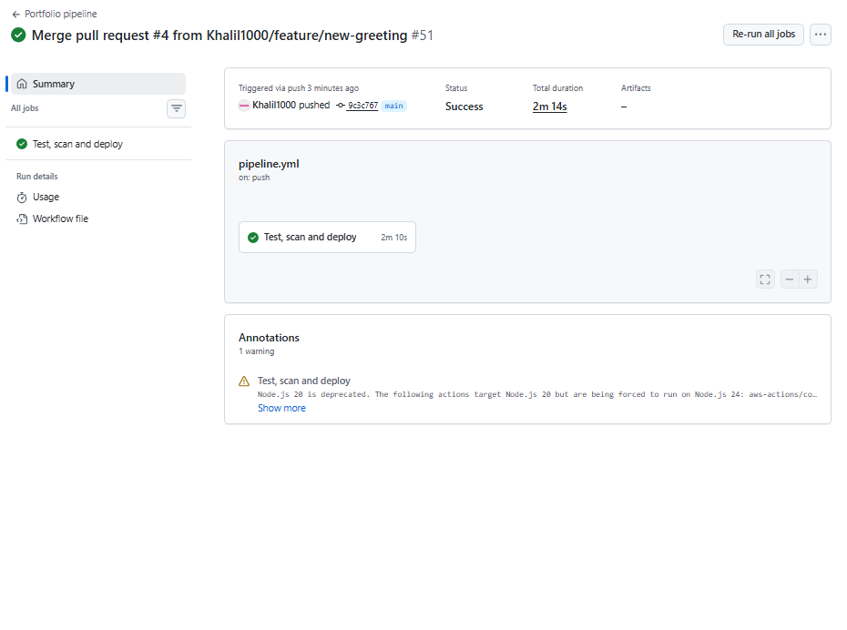

**Smoke tests pass against the `live` alias, and the version served is the merge commit.** The alias moved to version 7.

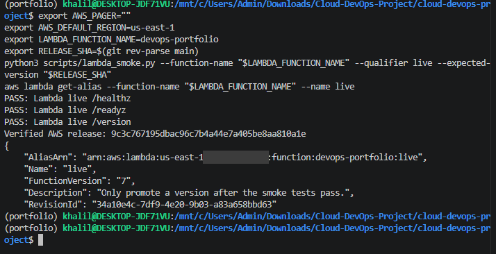

---

## Part 2: a failing test blocks delivery

**Setup:** on branch `demo/failing-test`, one line of `tests/test_app.py` was changed on purpose. In `test_liveness_remains_ok_when_readiness_fails`, the expected `/healthz` status went from `200` to `201`. The application code was not touched.

| Step | What happened | Screenshot |
|---|---|---|
| 1 | Test run locally: fails on the assertion | [3](#3-local-run-fails) |
| 2 | Pushed and opened [PR #5](https://github.com/Khalil1000/cloud-devops-project/pull/5) (commit `ecb3e50`) | [4](#4-pr-5-opened) |
| 3 | Run #52 fails after 12s. The merge button is disabled | [5](#5-the-required-check-fails-and-merging-is-blocked) to [8](#8-the-assertion-and-the-skipped-steps) |
| 4 | Restored the correct value (commit `a8bc4dc`) and pushed | [9](#9-restore-commit) |
| 5 | Run #53 passes. The PR becomes mergeable and the branch matches `main` | [10](#10-run-53-passes) to [12](#12-pr-5-is-mergeable-again) |
| 6 | PR closed without merging | [13](#13-pr-closed-without-merging) |
| 7 | `live` is still version 7 | [14](#14-live-is-unchanged) |

### 3. Local run fails

`FAIL: test_liveness_remains_ok_when_readiness_fails`, on the edited `/healthz` assertion.

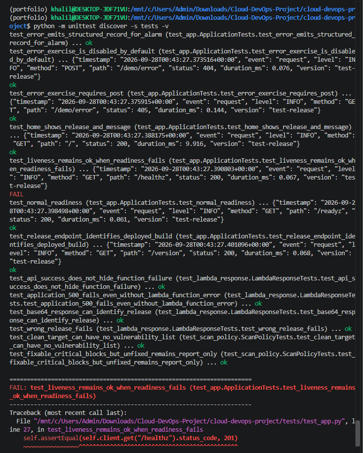

### 4. PR #5 opened

The diff is one line: `200` becomes `201`.

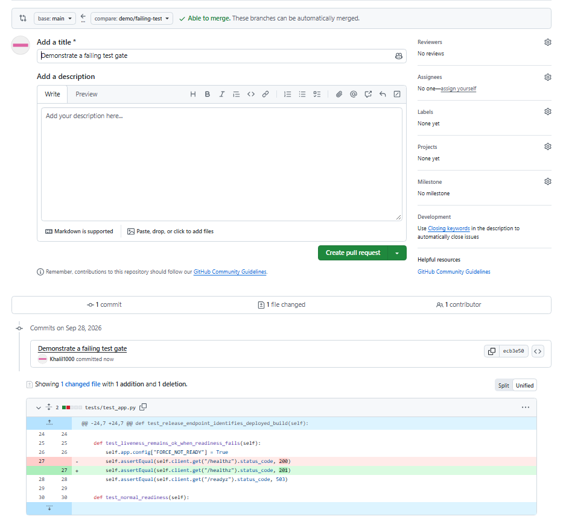

### 5. The required check fails and merging is blocked

"Checks failing", the pipeline is marked **Required**, and the **Merge pull request** button is greyed out.

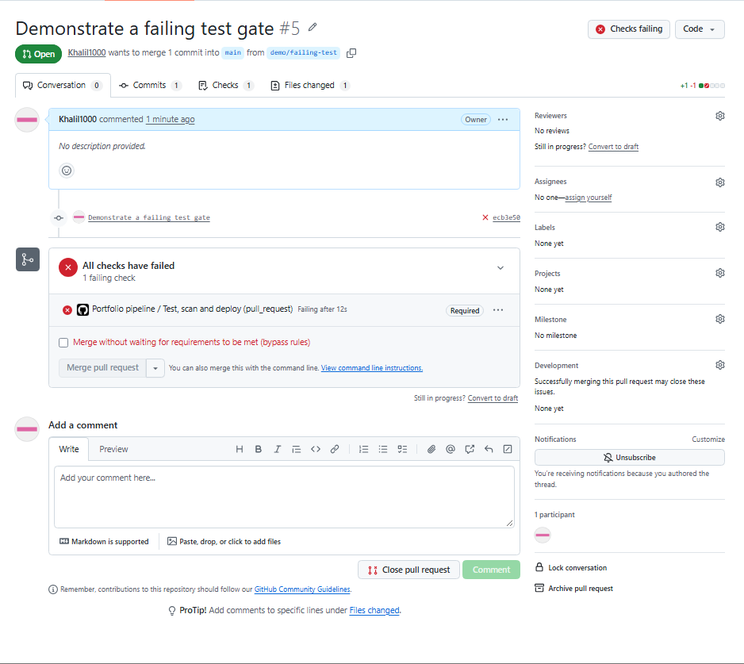

### 6. Run #52 fails fast

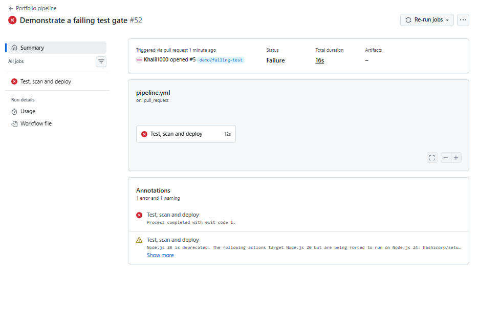

The job stopped after 12 seconds. The passing run #51 took 2m 14s, because the build, `kind` verification and AWS steps never ran here.

### 7. Steps before the failure

Setup steps pass, then **Test application and release checks** goes red.

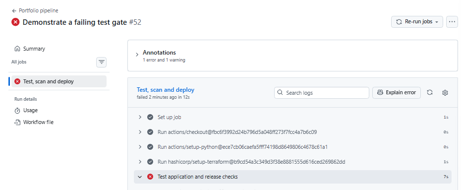

### 8. The assertion and the skipped steps

The log shows `AssertionError: 200 != 201`, `Ran 13 tests` and `FAILED (failures=1)`. Every later step is skipped, including **Obtain short-lived AWS credentials** and **Publish the verified image and promote AWS release**. The cluster cleanup step still runs because it is marked `if: always()`.

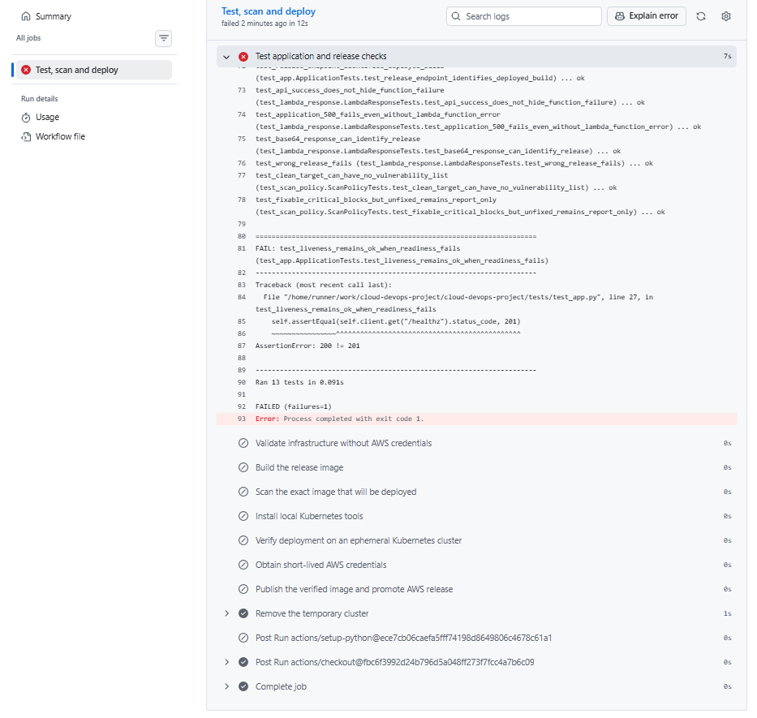

### 9. Restore commit

The test file was restored to its `main` version (`git checkout main -- tests/test_app.py`) and pushed.

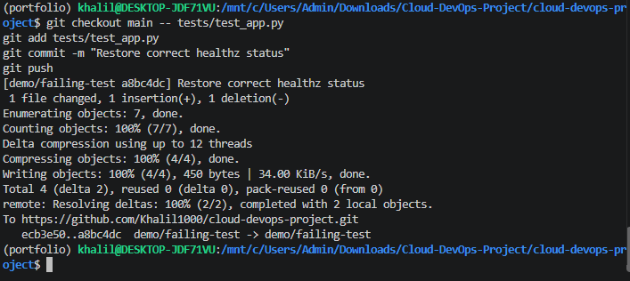

### 10. Run #53 passes

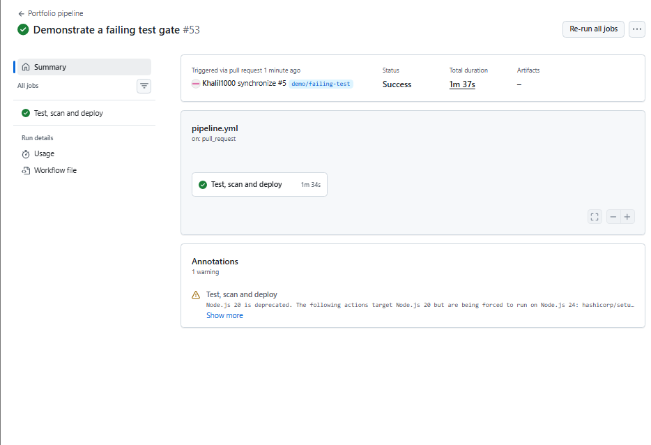

### 11. Run #53: tests pass, AWS steps skipped

The tests, Terraform validation, image build and `kind` verification all run. The two AWS steps show as **skipped** even though every check passed, because this is a pull request.

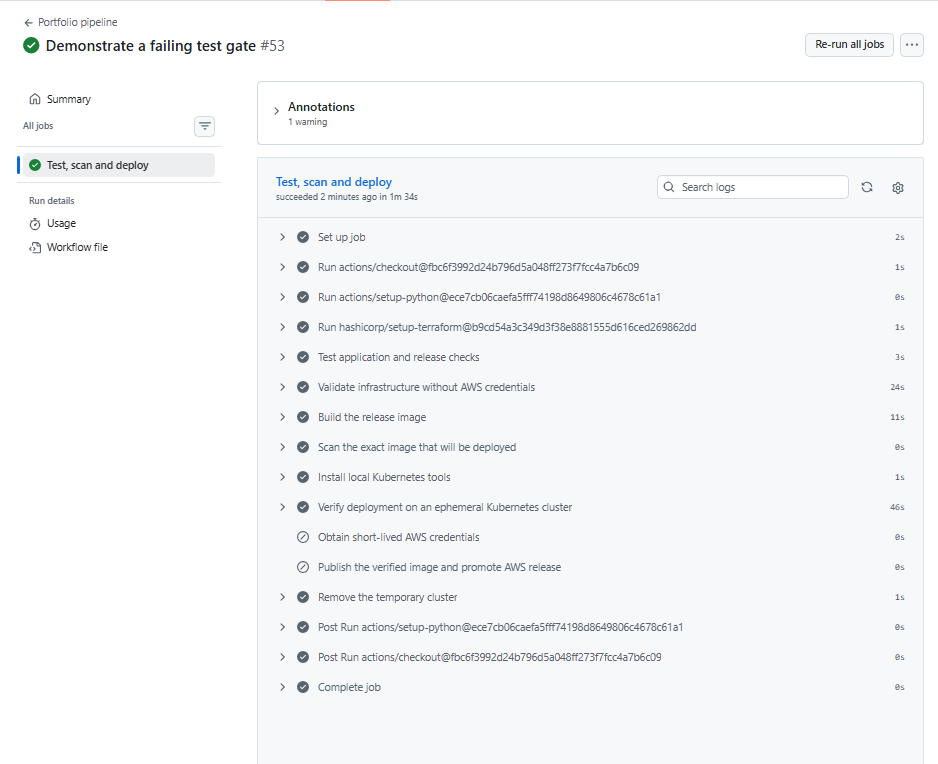

### 12. PR #5 is mergeable again

The first commit is marked failed and the restore commit passed. **Files changed is 0**, so the branch ends up identical to `main`.

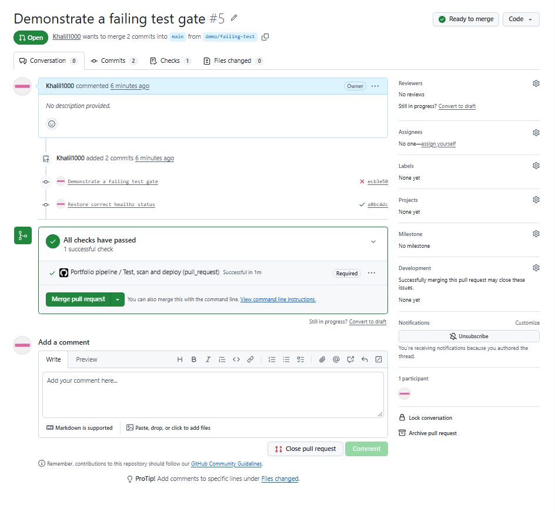

### 13. PR closed without merging

Closing it, not merging, keeps `main` and production untouched.

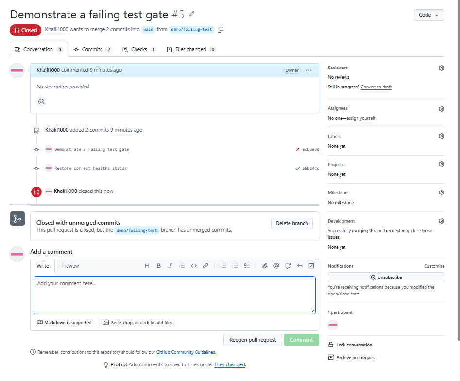

### 14. `live` is unchanged

`FunctionVersion` is still `7`, and the `RevisionId` (`34a10e4c-7df9-4e20-9b03-a83a658bbd63`) matches the value in screenshot 1. The revision ID changes whenever the alias is modified, so it matching is stronger proof than the version number alone.

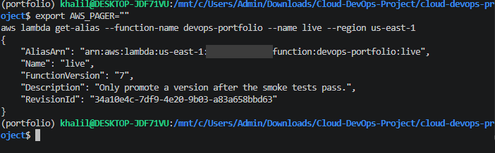

---

## Part 3: Kubernetes recovery, practiced locally

Run entirely on the local `kind` cluster, with no AWS cost and no effect on `live`. Two things were practiced: how a Deployment replaces a deleted pod on its own, and how a rolling update protects running traffic from a bad config change until it's rolled back. The full incident write-up, including root cause and what I'd improve, is in [`docs/INCIDENT_TEMPLATE.md`](../INCIDENT_TEMPLATE.md).

### Preflight

Cluster up, 2/2 pods ready, rollout already settled before either exercise started.

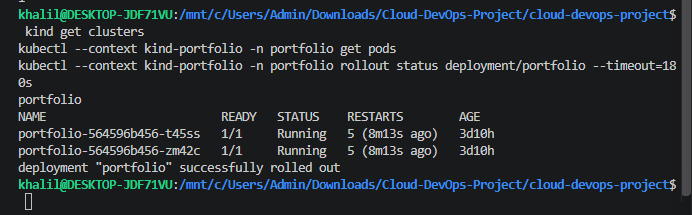

### Exercise A: a deleted pod is replaced automatically

One pod was deleted directly. No other action was taken.

**Delete command, with timestamps:**

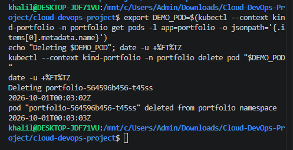

**Watched live:** the deleted pod goes `Terminating` → `Completed`, while the Deployment controller creates a replacement that goes `Pending` → `ContainerCreating` → `Running 1/1`, with no human action beyond the original delete.

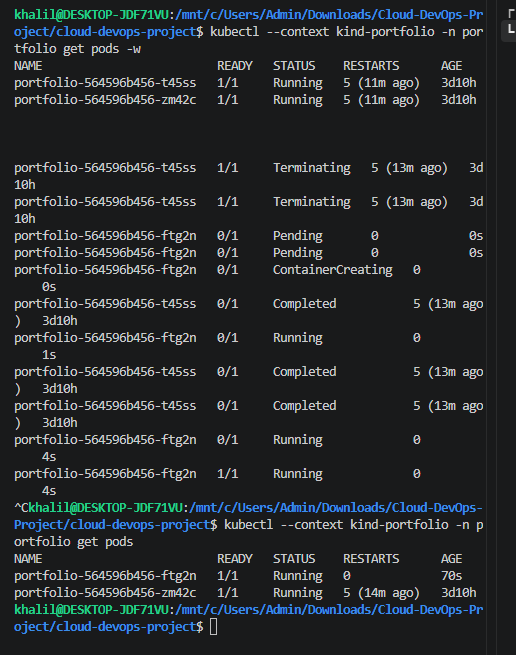

This demonstrates pod replacement only. It does not demonstrate recovery from losing an entire node.

### Exercise B: a bad config is rejected, old pods keep serving, then rolled back

**Fault introduced.** The good revision (`1`) was recorded, then `FORCE_NOT_READY=true` was set on the Deployment. `rollout status` is expected to fail here, and it did, after exceeding its progress deadline:

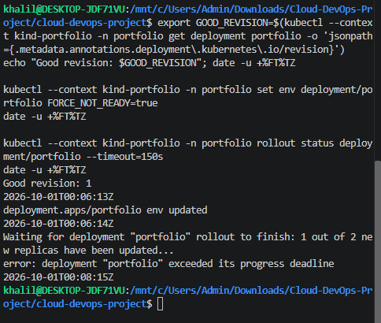

**Diagnosis, step 1:** `get pods` shows the two original pods still `1/1 Running` on the old revision, with one new candidate pod stuck at `0/1`. `describe deployment` shows the rolling-update strategy (`0 max unavailable, 1 max surge`), which is exactly why Kubernetes added one extra pod to test rather than touching the two healthy ones.

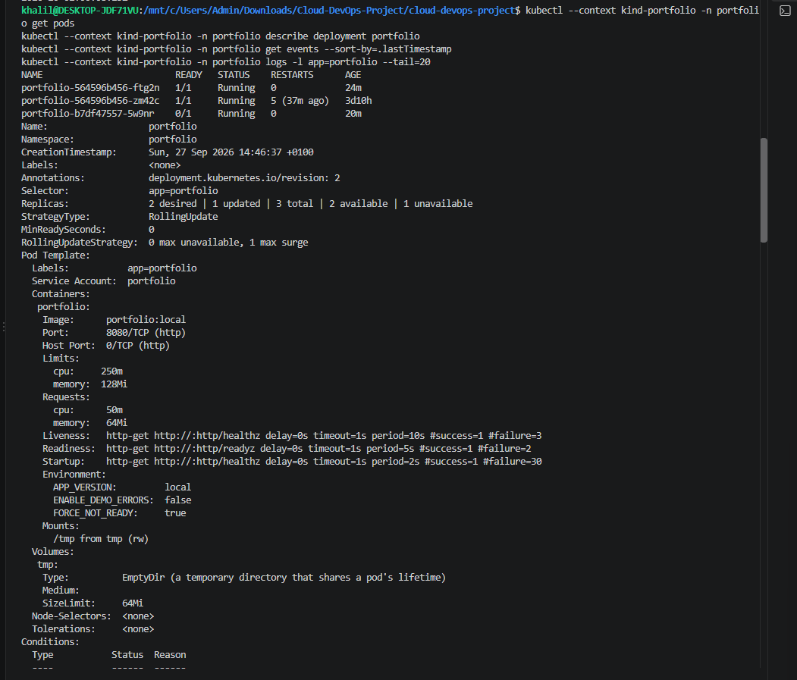

**Diagnosis, step 2:** the Conditions block confirms it directly — `Progressing False / ProgressDeadlineExceeded`.

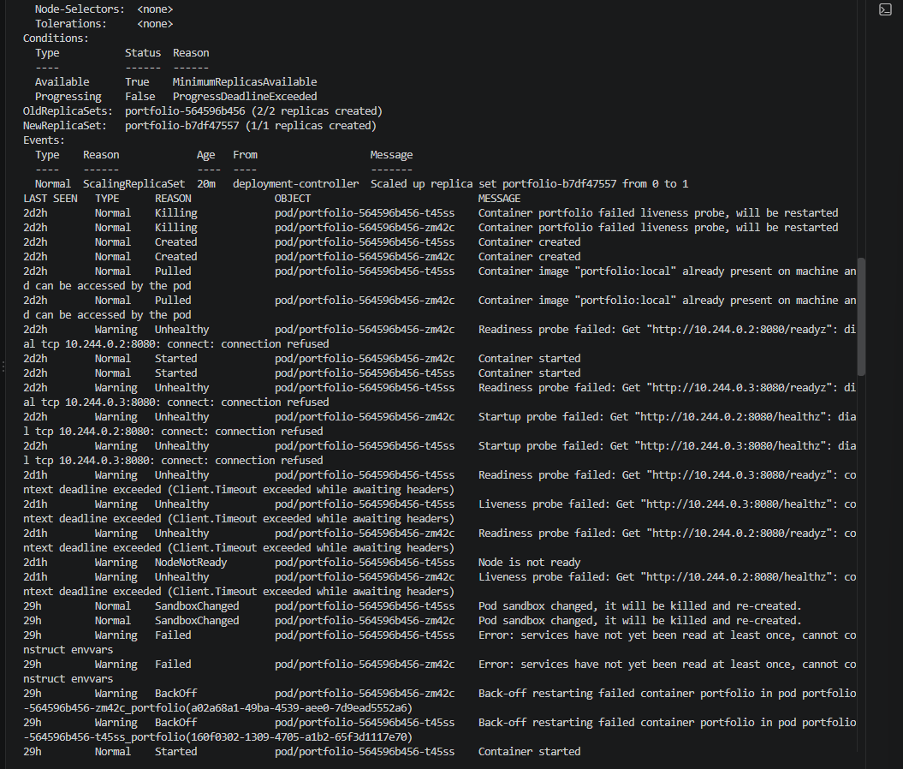

**Root cause, confirmed by Kubernetes itself:** the most recent event ties the failure to the exact readiness check.

```
Warning   Unhealthy   pod/portfolio-b7df47557-5w9nr   Readiness probe failed: HTTP probe failed with statuscode: 503
```

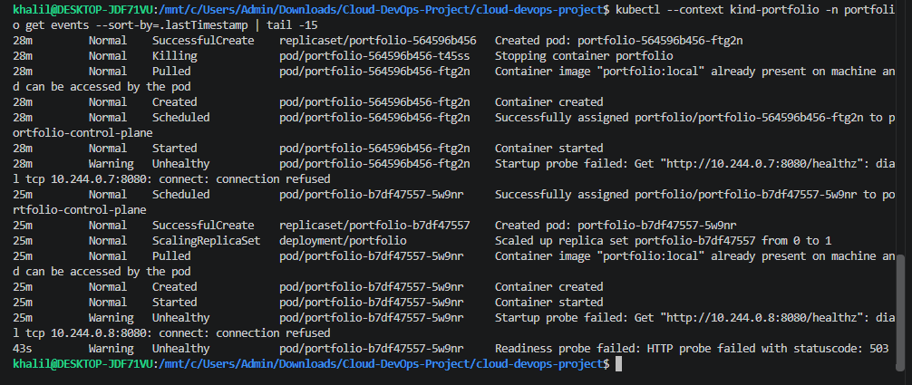

**Rollback.** The recorded good revision was restored:

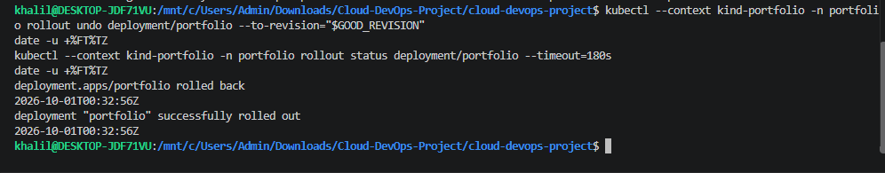

The undo command and `successfully rolled out` landed in the same second (`00:32:56Z`), because the Deployment only had to point back at the ReplicaSet that was already running — no new pod had to be scheduled.

**Pods confirmed clean:** back to 2/2, with the failed candidate gone entirely.

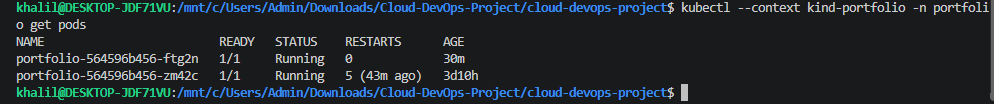

**Verified over real HTTP, not just the Deployment object.** Port-forwarded to the service, then ran the smoke test from a second terminal:

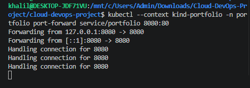

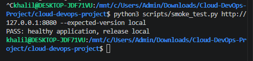

---

## Why a pull request cannot change production

Several independent layers each stop a broken change:

- **Required status check:** the branch rule blocks merging while the pipeline is red.
- **Step ordering:** tests run first in the same job, so a test failure prevents every later step.
- **Explicit conditions:** the AWS credential and publish steps only run for non-PR events on `main` with deployment enabled. Run #53 shows them skipped on a passing PR.
- **IAM trust policy:** the deploy role only trusts this repository's `main` branch.
- **Verified promotion:** `deploy_lambda.sh` moves the `live` alias only after the new version passes its own health checks.

## Problems found and fixed while building this

- **`NoCredentials` on PR runs.** A registry login ran before any AWS credentials existed. The unneeded login was removed.
- **Empty registry host.** A malformed `ECR_REPOSITORY_URL` variable made the ECR login fail with a confusing Docker error. The variable was corrected and the script now fails with a clear message if the registry host is empty.
- **Public ECR rate limiting (HTTP 429).** The build pulls the AWS Lambda Web Adapter image from a registry that throttles anonymous pulls from shared CI runners. The pinned `amd64` image is now mirrored to a public GHCR package and the Dockerfile references the mirror, which removes the external dependency.
- **Missing IAM permission.** The deploy role isn't allowed to request public ECR tokens, and the pipeline never needed them, so that login was dropped instead of widening the role.

## Known gaps

- **Image scanning is not implemented yet.** The "Scan the exact image that will be deployed" step is currently a placeholder that only prints a message, so it is not claimed as a control here.
- **Administrators can bypass the branch rule.** GitHub shows a "merge without waiting for requirements" option to repository admins. Even then, a `main` release only happens through this workflow, and its tests still have to pass.
- **Node.js 20 deprecation warning** on some GitHub Actions. It is cosmetic and will clear as the pinned actions are updated.
