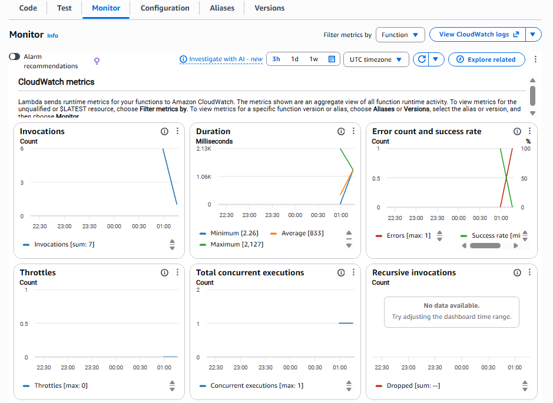
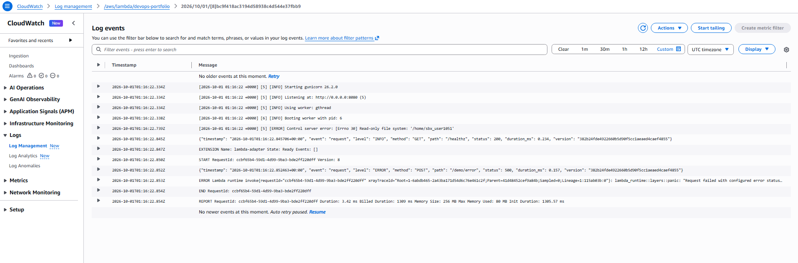
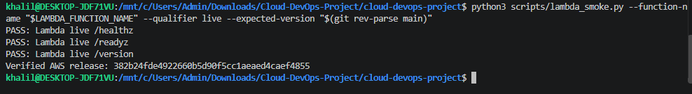
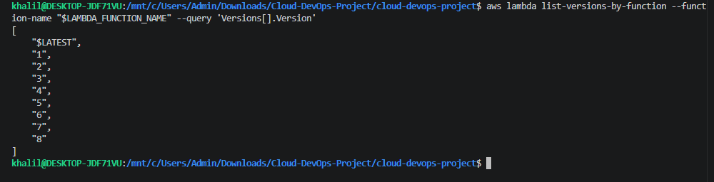
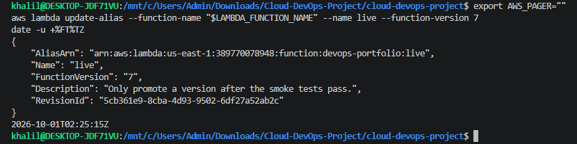
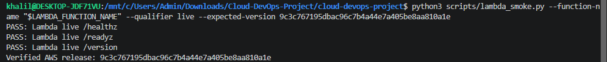
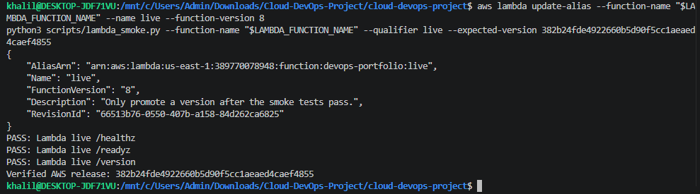

# CI/CD delivery evidence

Evidence for the delivery and verification behavior of [`.github/workflows/pipeline.yml`](../../.github/workflows/pipeline.yml):

1. **With AWS delivery enabled, a reviewed change merged to `main` is deployed to AWS Lambda automatically**, with no manual container pushes and no stored AWS access keys.
2. **A failing test blocks delivery.** A broken change turns the check red, stops the later steps, and cannot reach AWS.

The AWS account ID is blurred in the screenshots below.

**Latest verified AWS release (4 October 2026):** [Run #88](https://github.com/Khalil1000/cloud-devops-project/actions/runs/37166774042) passed all verification and AWS delivery steps for commit `cae347a70fa94f2000ab0165aae80d917aad0b6a` after the exact `main` OIDC trust restriction was applied. Earlier runs that skipped AWS remain historical CI evidence; run #88 verifies the updated image through Lambda release promotion.

## How the pipeline works

Everything runs in one job, so a failure in any step stops the steps after it.

| Order | Step | Runs on PRs? |
|---|---|---|
| 1 | Unit tests (`python -m unittest discover -s tests -v`) | Yes |
| 2 | Terraform `fmt` and `validate`, with no AWS credentials | Yes |
| 3 | Build the release image once | Yes |
| 4 | Image scan with Trivy, blocking on fixable HIGH/CRITICAL findings | Yes |
| 5 | Deploy that same image to an ephemeral `kind` Kubernetes cluster and verify it | Yes |
| 6 | Request short-lived AWS credentials through GitHub OIDC | **No** |
| 7 | Push the verified image to ECR and run `scripts/deploy_lambda.sh` to promote it to the `live` alias | **No** |

Steps 6 and 7 only run when the event is not a pull request, the ref is `main`, and the repository variable `AWS_DEPLOY_ENABLED` is exactly `true`. The IAM role also trusts only this repository's `main` branch, so a pull request cannot assume it even if the workflow were changed.

---

## Part 1: a merged change deploys to AWS automatically

The greeting in `app/app.py` and its expected value in `tests/test_app.py` were changed together on a branch, and the change was merged through [PR #4](https://github.com/Khalil1000/cloud-devops-project/pull/4). The push to `main` started run #51, which passed and promoted a new Lambda version.

| | Before | After |
|---|---|---|
| Lambda `live` version | 6 | **7** |
| Commit served | `23c0c32a821e72cb4bd7a176f55b0773f28591fc` | `9c3c767195dbac96c7b4a44e7a405be8aa810a1e` |

**Run #51 on `main` succeeded (2m 14s), including the AWS release steps.**


**Smoke tests pass against the `live` alias, and the version served is the merge commit.** The alias moved to version 7.


---

## Part 2: a failing test blocks delivery

**Setup:** on branch `demo/failing-test`, one line of `tests/test_app.py` was changed on purpose. In `test_liveness_remains_ok_when_readiness_fails`, the expected `/healthz` status went from `200` to `201`. The application code was not touched.

| Step | What happened | Screenshot |
|---|---|---|
| 1 | Test run locally: fails on the assertion | [3](#3-local-run-fails) |
| 2 | Pushed and opened [PR #5](https://github.com/Khalil1000/cloud-devops-project/pull/5) (commit `ecb3e50`) | [4](#4-pr-5-opened) |
| 3 | Run #52 fails after 12s. The merge button is disabled | [5](#5-the-required-check-fails-and-merging-is-blocked) to [8](#8-the-assertion-and-the-skipped-steps) |
| 4 | Restored the correct value (commit `a8bc4dc`) and pushed | [9](#9-restore-commit) |
| 5 | Run #53 passes. The PR becomes mergeable and the branch matches `main` | [10](#10-run-53-passes) to [12](#12-pr-5-is-mergeable-again) |
| 6 | PR closed without merging | [13](#13-pr-closed-without-merging) |
| 7 | `live` is still version 7 | [14](#14-live-is-unchanged) |

### 3. Local run fails

`FAIL: test_liveness_remains_ok_when_readiness_fails`, on the edited `/healthz` assertion.


### 4. PR #5 opened

The diff is one line: `200` becomes `201`.


### 5. The required check fails and merging is blocked

"Checks failing", the pipeline is marked **Required**, and the **Merge pull request** button is greyed out.


### 6. Run #52 fails fast


The job stopped after 12 seconds. The passing run #51 took 2m 14s, because the build, `kind` verification and AWS steps never ran here.

### 7. Steps before the failure

Setup steps pass, then **Test application and release checks** goes red.


### 8. The assertion and the skipped steps

The log shows `AssertionError: 200 != 201`, `Ran 13 tests` and `FAILED (failures=1)`. Every later step is skipped, including **Obtain short-lived AWS credentials** and **Publish the verified image and promote AWS release**. The cluster cleanup step still runs because it is marked `if: always()`.


### 9. Restore commit

The test file was restored to its `main` version (`git checkout main -- tests/test_app.py`) and pushed.


### 10. Run #53 passes


### 11. Run #53: tests pass, AWS steps skipped

The tests, Terraform validation, image build and `kind` verification all run. The two AWS steps show as **skipped** even though every check passed, because this is a pull request.


### 12. PR #5 is mergeable again

The first commit is marked failed and the restore commit passed. **Files changed is 0**, so the branch ends up identical to `main`.


### 13. PR closed without merging

Closing it, not merging, keeps `main` and production untouched.


### 14. `live` is unchanged

`FunctionVersion` is still `7`, and the `RevisionId` (`34a10e4c-7df9-4e20-9b03-a83a658bbd63`) matches the value in screenshot 1. The revision ID changes whenever the alias is modified, so it matching is stronger proof than the version number alone.


---

## Part 3: Kubernetes recovery on a local cluster

Run entirely on the local `kind` cluster, with no AWS cost and no effect on `live`. The exercises verified automatic pod replacement and recovery from a failed readiness rollout while the previous revision continued serving traffic. The incident report records the root cause, recovery, and follow-up considerations in [`docs/INCIDENT_REPORT.md`](../INCIDENT_REPORT.md).

### Preflight

Cluster up, 2/2 pods ready, rollout already settled before either exercise started.


### Exercise A: a deleted pod is replaced automatically

One pod was deleted directly. No other action was taken.

**Delete command, with timestamps:**


**Watched live:** the deleted pod goes `Terminating` → `Completed`, while the Deployment controller creates a replacement that goes `Pending` → `ContainerCreating` → `Running 1/1`, with no human action beyond the original delete.


This demonstrates pod replacement only. It does not demonstrate recovery from losing an entire node.

### Exercise B: a bad config is rejected, old pods keep serving, then rolled back

**Fault introduced.** The good revision (`1`) was recorded, then `FORCE_NOT_READY=true` was set on the Deployment. `rollout status` is expected to fail here, and it did, after exceeding its progress deadline:


**Diagnosis, step 1:** `get pods` shows the two original pods still `1/1 Running` on the old revision, with one new candidate pod stuck at `0/1`. `describe deployment` shows the rolling-update strategy (`0 max unavailable, 1 max surge`), which is exactly why Kubernetes added one extra pod to test rather than touching the two healthy ones.


**Diagnosis, step 2:** the Conditions block confirms it directly — `Progressing False / ProgressDeadlineExceeded`.


**Root cause, confirmed by Kubernetes itself:** the most recent event ties the failure to the exact readiness check.

```
Warning   Unhealthy   pod/portfolio-b7df47557-5w9nr   Readiness probe failed: HTTP probe failed with statuscode: 503
```


**Rollback.** The recorded good revision was restored:


The undo command and `successfully rolled out` landed in the same second (`00:32:56Z`), because the Deployment only had to point back at the ReplicaSet that was already running — no new pod had to be scheduled.

**Pods confirmed clean:** back to 2/2, with the failed candidate gone entirely.


**Verified over real HTTP, not just the Deployment object.** Port-forwarded to the service, then ran the smoke test from a second terminal:


---

## Part 4: an AWS error surfaces correctly, and a Lambda rollback works

Both run directly against the deployed `live` Lambda function — no local cluster involved. Neither affected end users: the error path is a single authenticated, synchronous invocation of a demo endpoint explicitly enabled in the AWS configuration, and the rollback was verified and then restored within the same session.

### A deliberate error is visible in Lambda's own metrics and logs

A single authenticated invocation was made against a demo endpoint that always returns an HTTP 500:

```
$ aws lambda invoke --function-name devops-portfolio --qualifier live \
    --cli-binary-format raw-in-base64-out --payload file://events/error.json \
    evidence/private/error-response.json
{
    "StatusCode": 200,
    "FunctionError": "Unhandled",
    "ExecutedVersion": "8"
}
{
    "errorType": "&alloc::boxed::Box<dyn core::error::Error + core::marker::Send + core::marker::Sync>",
    "errorMessage": "Request failed with configured error status code: 500"
}
```

`StatusCode: 200` only means Lambda successfully invoked the function — `FunctionError: "Unhandled"` is the actual signal that this was recorded as an execution error, not a successful response. That distinction exists because the Lambda Web Adapter is configured with `AWS_LWA_ERROR_STATUS_CODES=500-599`, which converts an HTTP 500 from the app into a Lambda-level failure.

**The error is visible in Lambda's own Errors metric:**



**And in the structured CloudWatch log for that exact request** — the app's own `"level": "ERROR"` record for `POST /demo/error` returning `500`, immediately followed by the Lambda runtime's panic message, with a healthy `/healthz` check from the same worker in the same window for contrast:



**The function was not left broken.** A normal smoke test right after confirms `live` is healthy and still serving the correct release:



### Optional: rolling a live Lambda alias back to a prior version

Separate from the Kubernetes rollback in Part 3, this demonstrates the AWS-specific recovery path: pointing the immutable `live` alias at an older published version directly, without redeploying anything.

**Available versions:**



**Rolled back to version 7** (the version behind the current release):



**Verified over real HTTP that the rollback actually took effect** — not just that the alias metadata changed, but that `live` was genuinely serving the older commit:



**Restored to the current version** before finishing, so the account wasn't left on an old release:



---

## Part 5: the vulnerability gate blocks delivery, then passes after remediation

The first real CI execution of the scan in [run #64](https://github.com/Khalil1000/cloud-devops-project/actions/runs/37080837934) reported six fixable HIGH/CRITICAL findings and stopped the job before Kubernetes verification or AWS delivery. Repeating the scan returned the same findings.

The local JSON report showed old `jaraco.context` and `wheel` copies bundled inside `setuptools`, while the remaining findings were attributed to an embedded software inventory (SBOM). The top-level packages were already at the fix versions reported by the scanner, so upgrading those packages alone did not clear the gate.

The Dockerfile now installs and checks application dependencies, then uninstalls `pip`, `setuptools`, and `wheel` from the runtime image. The scanner policy was not weakened and no vulnerability exceptions were added. The rebuilt image reported `0 fixable HIGH/CRITICAL vulnerabilities`; this describes the configured gate, not an absence of all vulnerabilities.

| Verification | Result |
|---|---|
| [PR run #65](https://github.com/Khalil1000/cloud-devops-project/actions/runs/37083694063) | Passed after removal of the runtime installation tools |
| [Merged PR #13](https://github.com/Khalil1000/cloud-devops-project/pull/13) | Included the real scan gate and runtime-image fix |
| [Main run #66](https://github.com/Khalil1000/cloud-devops-project/actions/runs/37083931737) | Tests, Terraform validation, build, scan and Kubernetes verification passed |
| AWS delivery in run #66 | Skipped because `AWS_DEPLOY_ENABLED=false`; no new Lambda deployment was demonstrated by this run |

## Part 6: AWS release verified after the trust-policy restriction

[Run #88](https://github.com/Khalil1000/cloud-devops-project/actions/runs/37166774042) was manually dispatched on `main` on 4 October 2026 for source commit `cae347a70fa94f2000ab0165aae80d917aad0b6a`. The job completed successfully with both AWS steps executed, rather than skipped.

| Stage | Recorded result |
|---|---|
| Application and release tests | Passed |
| Terraform validation | Passed |
| Docker image build | Passed |
| Trivy security gate | Passed under the existing fixable HIGH/CRITICAL policy |
| Kubernetes rollout and HTTP verification | Passed |
| Obtain short-lived AWS credentials | Passed using GitHub OIDC |
| Publish the verified image and promote AWS release | Passed |

The role's live trust condition had already been verified to match only `repo:Khalil1000@138799611/cloud-devops-project@1379707365:ref:refs/heads/main` using `StringEquals`. This run confirms that the permitted main-branch workflow can still authenticate and release after removing the wildcard subjects.

The release script pushes the checked image to ECR, publishes an immutable Lambda version, checks the candidate's health, readiness, and expected commit, then promotes and verifies the `live` alias. Its successful completion closes the previously outstanding AWS deployment verification. This run does not demonstrate a new rollback or a denied OIDC request; those are separate from successful release verification.

## Why a pull request cannot change production

Several independent layers each stop a broken change:

- **Required status check:** the branch rule blocks merging while the pipeline is red.
- **Step ordering:** tests run first in the same job, so a test failure prevents every later step.
- **Explicit conditions:** the AWS credential and publish steps only run for non-PR events on `main` with deployment enabled. Run #53 shows them skipped on a passing PR.
- **IAM trust policy:** the deploy role only trusts this repository's `main` branch.
- **Verified promotion:** `deploy_lambda.sh` moves the `live` alias only after the new version passes its own health checks.

## Problems found and fixed while building this

- **`NoCredentials` on PR runs.** A registry login ran before any AWS credentials existed. The unneeded login was removed.
- **Empty registry host.** A malformed `ECR_REPOSITORY_URL` variable made the ECR login fail with a confusing Docker error. The variable was corrected and the script now fails with a clear message if the registry host is empty.
- **Public ECR rate limiting (HTTP 429).** The build pulls the AWS Lambda Web Adapter image from a registry that throttles anonymous pulls from shared CI runners. The pinned `amd64` image is now mirrored to a public GHCR package and the Dockerfile references the mirror, which removes the external dependency.
- **Missing IAM permission.** The deploy role isn't allowed to request public ECR tokens, and the pipeline never needed them, so that login was dropped instead of widening the role.
- **The vulnerability scan gate was documented but not wired up.** `scripts/scan_image.sh` already ran a real Trivy scan and correctly blocked on fixable HIGH/CRITICAL findings when run by hand, but the CI step that was supposed to call it was still a placeholder that only printed a message. CI now calls the real script, wrapped in the same retry pattern used for the image build, since the scanner pulls its own container image and vulnerability database over the network and can hit the same kind of transient registry flakiness documented above.

## Known gaps

- **Administrators can bypass the branch rule.** GitHub shows a "merge without waiting for requirements" option to repository admins. Even then, a `main` release only happens through this workflow, and its tests still have to pass.
- **Terraform action runtime maintenance resolved:** PR #1 upgraded setup-terraform to v4.0.1. Main run #80 passed without check annotations.
- **No CloudWatch alarm or email alerting is configured.** The pipeline demonstrates that an error surfaces correctly in Lambda's `Errors` metric and in structured CloudWatch logs (see Part 4), which is the operational-visibility evidence this project relies on. The optional CloudWatch alarm and SNS subscription remain outside the demonstrated scope.
